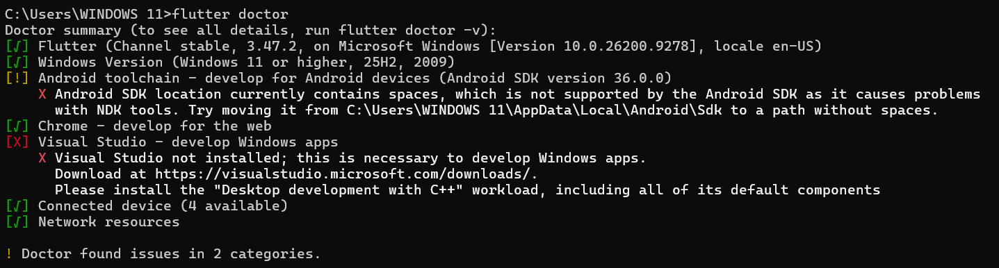
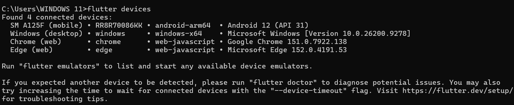
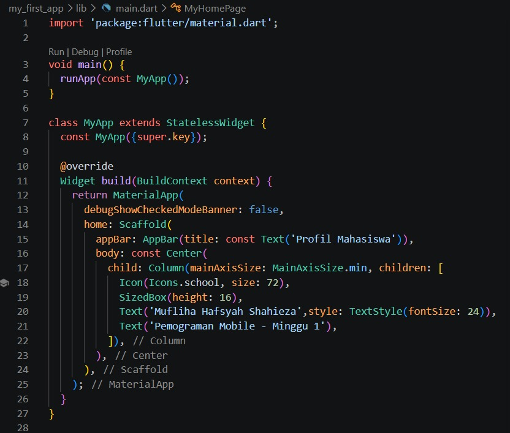
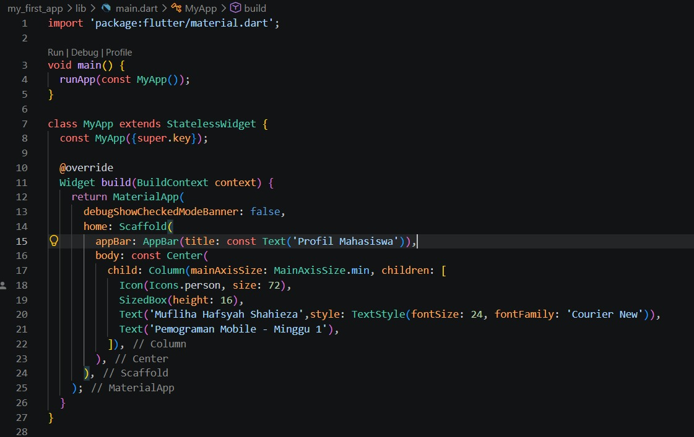
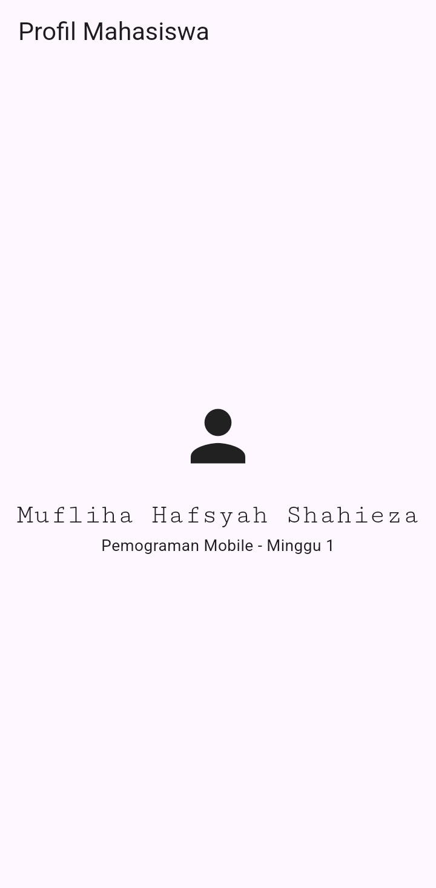
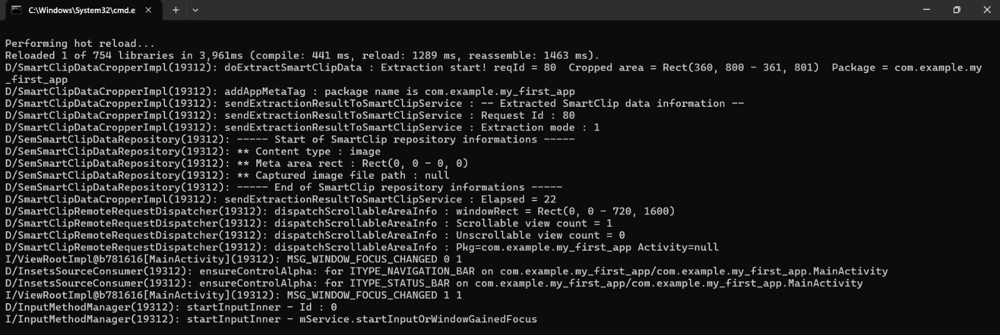
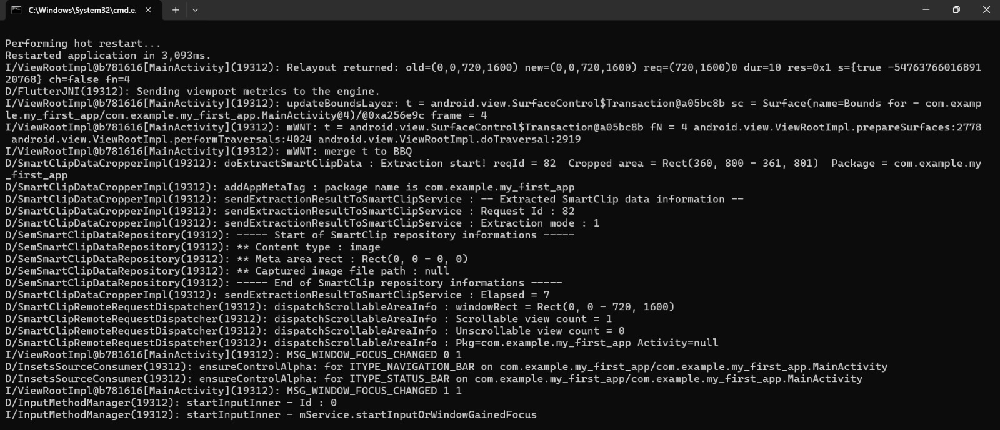
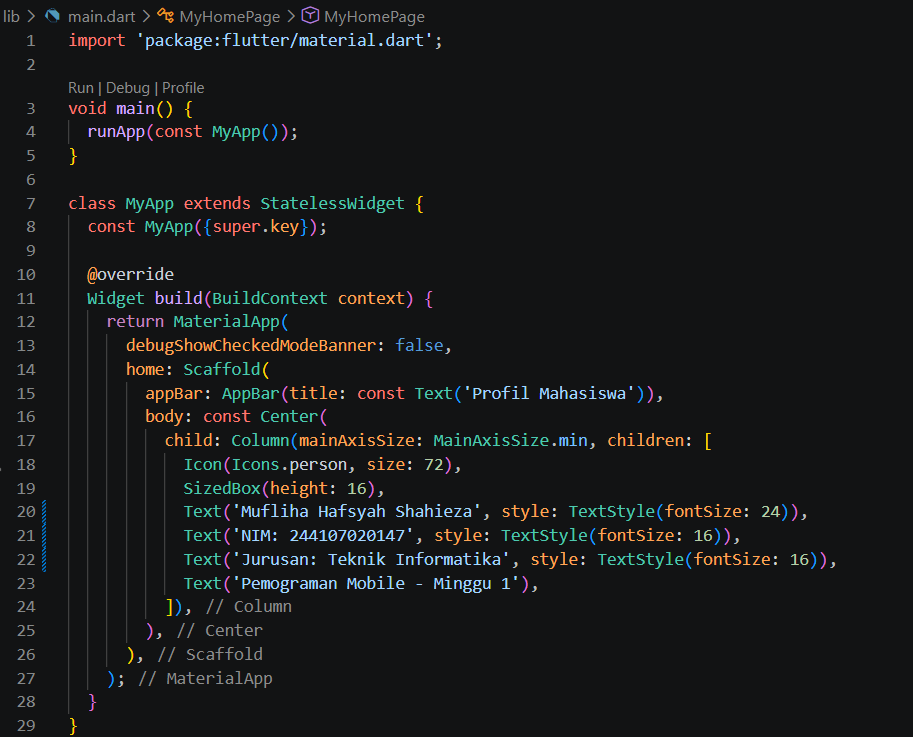
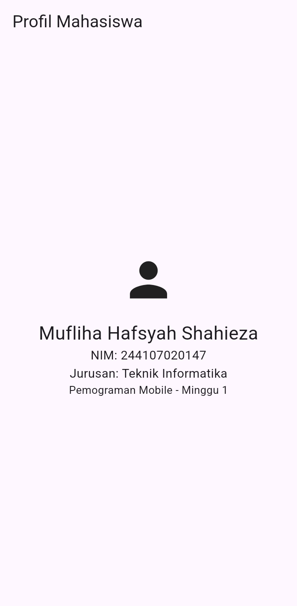

# LAPORAN PRAKTIKUM - WEEK 1 PEMROGRAMAN MOBILE

## Identitas Mahasiswa

| Keterangan | Detail |
|---|---|
| Nama | Mufliha Hafsyah Shahieza |
| NIM | 244107020147 |
| Kelas | TI-3G |

---

## JOBSHEET WEEK 1
**Mobile Development Ecosystem & Flutter Refresh**

### Hasil Praktikum

#### Verifikasi Environment

#### Aplikasi Default (Sebelum Diubah)

#### Aplikasi Profil Mahasiswa (Setelah Diubah)

#### Perbandingan Hot Reload vs Hot Restart

 
Penjelasan:  
- Hot reload memperbarui tampilan visual secara instan dalam hitungan milidetik dengan menyuntikkan perubahan kode tanpa menghapus status (state) aplikasi yang sedang berjalan. 
- Sedangkan hot restart memuat ulang seluruh basis kode dari fungsi utama (main()) yang memakan waktu beberapa detik dan mereset seluruh state aplikasi kembali ke kondisi awal.

### Mini Assignment 

### Kendala Setup
- Terdeteksi peringatan "Android SDK location currently contains spaces" akibat penggunaan spasi pada nama folder pengguna Windows. Kendala ini tidak mengganggu fungsi utama Flutter, tetapi berpotensi menimbulkan masalah apabila proyek membutuhkan komponen NDK (native code).
- Proses konfigurasi sempat terhambat oleh error Unable to locate Android SDK karena Flutter belum mengenali jalur SDK secara otomatis. Masalah ini diatasi dengan mendaftarkan lokasi SDK melalui perintah flutter config --android-sdk "<path-sdk>".
- Saat pertama kali dihubungkan, perangkat fisik sempat mengalami status not authorized dan lost connection to device. Penanganan dilakukan dengan menyetujui opsi USB debugging pada perangkat serta menjaga layar tetap aktif selama proses build berlangsung.

### Refleksi
- **Kapan native lebih tepat dipilih daripada cross-platform?**  
Jawaban: 
Native lebih tepat ketika aplikasi membutuhkan performa maksimal, akses penuh ke fitur hardware/OS terbaru, atau UI yang sangat spesifik ke satu platform. Cross-platform (seperti Flutter) lebih efisien untuk membangun aplikasi dengan tampilan konsisten di banyak platform sekaligus dengan satu basis kode.

- **Bagaimana perubahan state berhubungan dengan widget tree dan UI deklaratif?** 
Jawaban: 
Di Flutter, UI dibangun secara deklaratif berdasarkan state saat ini. Ketika state berubah, widget tree dibangun ulang (rebuild) untuk merefleksikan kondisi terbaru. Hot reload memanfaatkan hal ini dengan menyuntikkan kode baru tanpa mereset state, sedangkan hot restart membangun ulang seluruh tree dari awal sehingga state kembali ke kondisi awal.

- **Mengapa commit kecil dengan pesan jelas bermanfaat bagi pekerjaan tim dan portofolio?** 
Jawaban: 
Commit kecil dan jelas memudahkan tracking perubahan, mempermudah proses review dan debugging jika ada error, serta membuat riwayat pengembangan lebih mudah dipahami oleh diri sendiri maupun orang lain di kemudian hari.

---