# LAPORAN PRAKTIKUM - WEEK 2 PEMROGRAMAN MOBILE

## Identitas Mahasiswa

| Keterangan | Detail |
|---|---|
| Nama | Mufliha Hafsyah Shahieza |
| NIM | 244107020147 |
| Kelas | TI-3G |

---

## JOBSHEET WEEK 2 Declarative UI & Responsive Design

---
### Praktikum: layout sederhana (warm-up)

#### Kondisi normal (setelah data diisi)
 <br>

Kartu tampil rapi, terpusat di layar, dengan avatar, nama, NIM, dan Kelas sesuai pola `Row` + `Expanded`.

### Eksperimen warm-up
#### Eksperimen 1 — Menghapus Expanded pada baris nama
<br>

Ketika teks nama diperpanjang secara signifikan, muncul garis kuning-hitam (overflow warning).

**Analisis:** <br>
Tanpa `Expanded`, `Row` memberi `Column` di dalamnya ukuran *natural/unconstrained*, dia mencoba menampilkan kontennya selebar yang dibutuhkan, bukan dibatasi sisa ruang yang tersedia. Jika lebar natural itu melebihi sisa ruang di `Row`, terjadi overflow karena `Row` tidak bisa memaksa child mengecil tanpa `Expanded` atau `Flexible`.<br>

<br>
Sebaliknya, dengan `Expanded`, `Row` membatasi lebar `Column` sesuai sisa ruang yang tersedia. Karena `Text` secara default bisa wrap, begitu lebarnya dibatasi, teks otomatis pindah ke baris berikutnya (multi-line) alih-alih meluber keluar batas layout.

#### Eksperimen 2 — Menghapus mainAxisSize: MainAxisSize.min
<br>

**Analisis:** <br>
`MainAxisSize.min` membuat `Column` hanya meminta tinggi minimum yang dibutuhkan kontennya. Setelah dihapus, default-nya menjadi `MainAxisSize.max`, sehingga `Column` mengambil seluruh tinggi yang tersedia dari parent (`Container` yang dipusatkan dalam `Scaffold` seukuran layar). Akibatnya, kartu melebar mengisi seluruh tinggi layar meski isinya hanya beberapa baris teks.<br> 
Hal ini menunjukkan pentingnya `MainAxisSize.min` ketika kita ingin sebuah container/kartu membungkus rapat kontennya, bukan ikut memenuhi ruang parent yang jauh lebih besar.

#### Eksperimen 3 — Menambahkan Baris Data (Email)
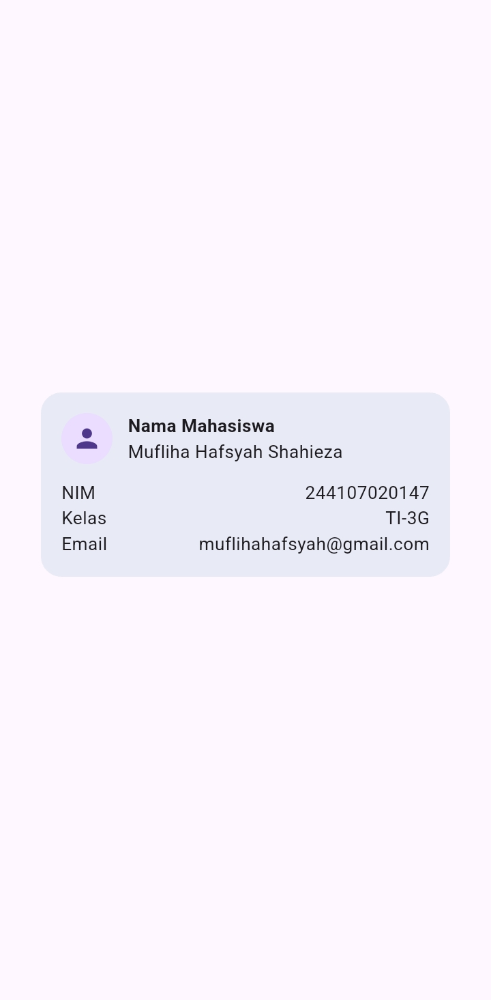<br>

**Analisis:**<br>
Pola `Row` + `Expanded` bersifat reusable, menambah baris data baru cukup dengan menduplikasi struktur yang sama tanpa mengubah bagian lain. Tinggi kartu bertambah otomatis mengikuti jumlah konten karena `MainAxisSize.min` masih aktif.

#### Kesimpulan 
- `Expanded` di dalam `Row`/`Column` berfungsi memberi batas ruang (constraint) ke child-nya, mencegah overflow sekaligus memungkinkan teks untuk wrap ketika kontennya panjang.
- `MainAxisSize.min` penting digunakan ketika sebuah `Column`/`Row` harus membungkus rapat kontennya, bukan ikut memenuhi ruang parent yang lebih besar.
kut memenuhi ruang parent yang lebih besar.
- Pola `Row` + `Expanded` (label kiri, value kanan) bersifat reusable untuk menambah baris data baru tanpa perlu mengubah struktur widget lainnya.

---
### Praktikum: dashboard responsif 

#### Hasil Implementasi Pada Layar Sempit
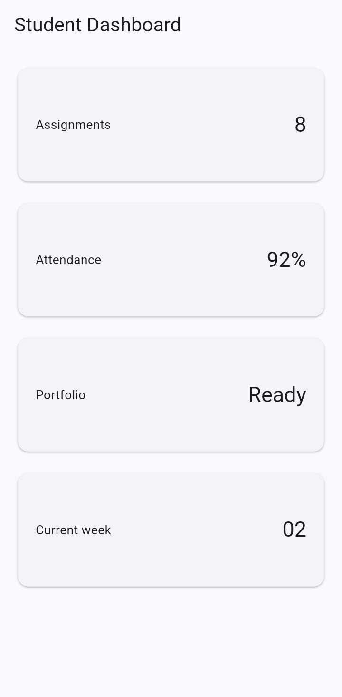<br>
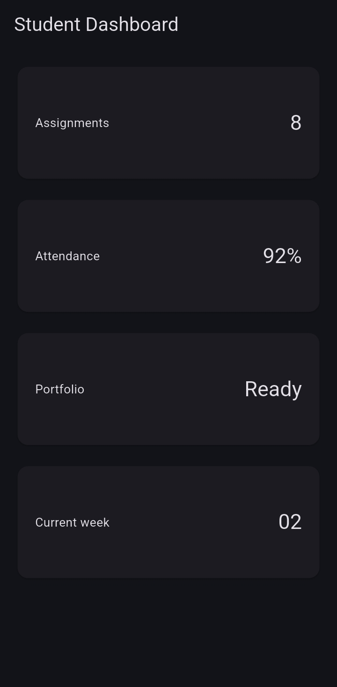<br> 
Menampilkan 1 kolom, kartu tersusun vertikal.

#### Hasil Implementasi Pada Layar Lebar
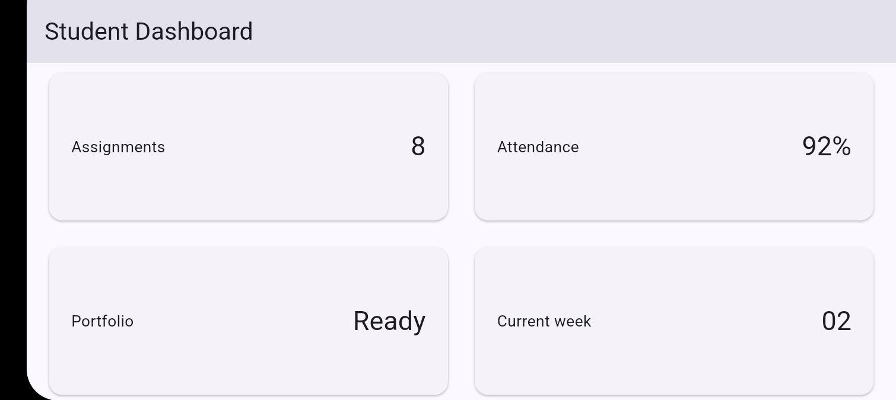<br>
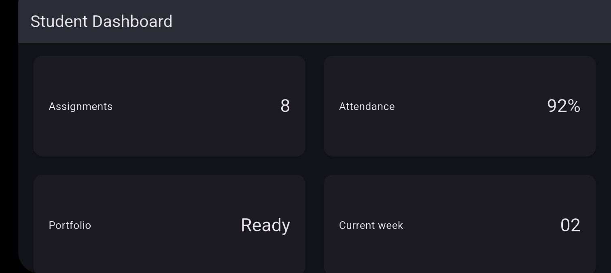<br> 
Menampilkan 2 kolom sejajar, sesuai breakpoint `700px`.<br>

**Analisis:**<br>
`LayoutBuilder` memberi akses ke `constraints` dari parent, sehingga jumlah kolom bisa dihitung ulang secara reaktif setiap kali ukuran layar berubah (misal rotasi layar), tanpa perlu logic imperative untuk mendeteksi perubahan orientasi secara manual.

#### Mengubah DashboardApp dari StatelessWidget menjadi StatefulWidget
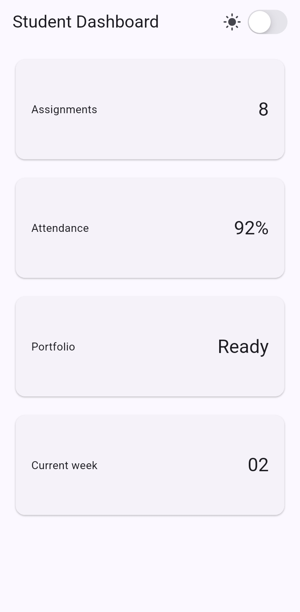<br>
<br>
`CupertinoSwitch` berhasil mengubah tema aplikasi secara manual, terlepas dari setting sistem. Berbeda dengan praktikum sebelumnya yang mengikuti `ThemeMode.system`.
---
### Eksperimen Layout
#### Eksperimen 1 - Ubah breakpoint dari 700 menjadi nilai lain dan amati perubahan jumlah kolom.
Breakpoint diturunkan dari `700` ke `350`<br>
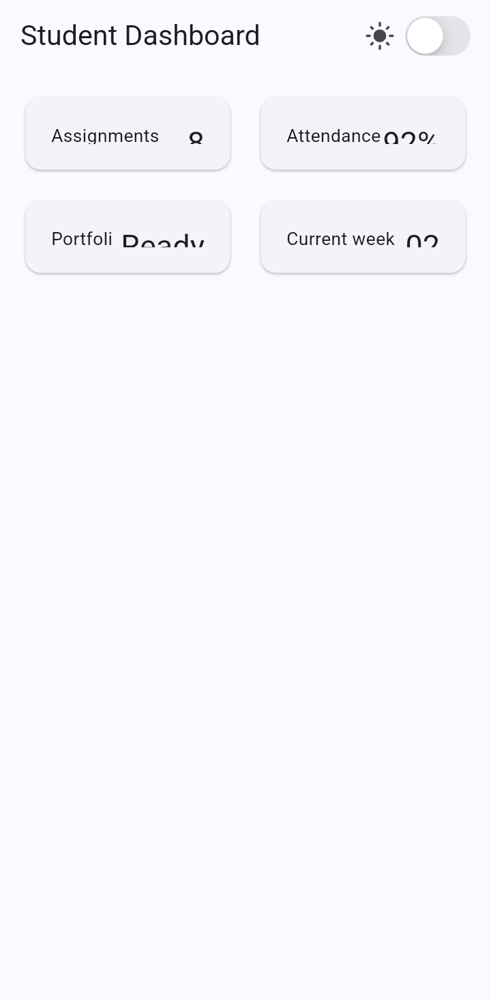<br>
Grid berubah menjadi 2 kolom bahkan pada layar HP potret. Ini menunjukkan breakpoint yang terlalu rendah membuat kartu menjadi terlalu sempit dan kurang nyaman dibaca, breakpoint 700px lebih sesuai untuk membedakan HP vs tablet.

#### Eksperimen 2 - Ubah themeMode menjadi ThemeMode.dark, lalu kembalikan ke ThemeMode.system.
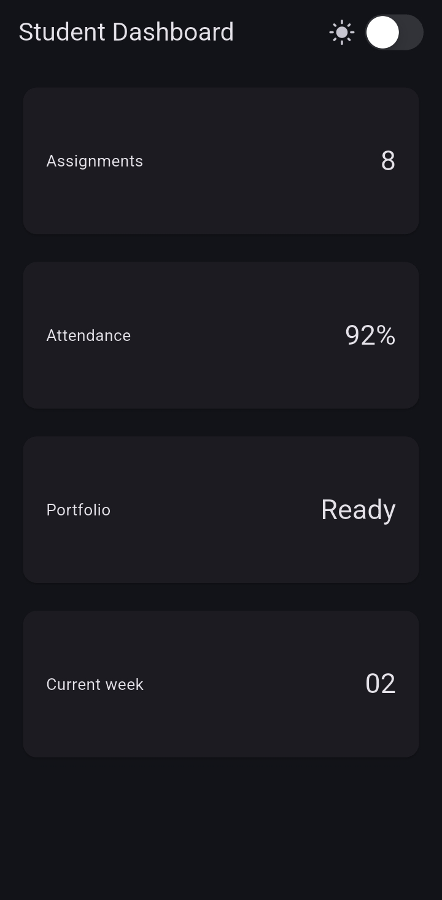<br>
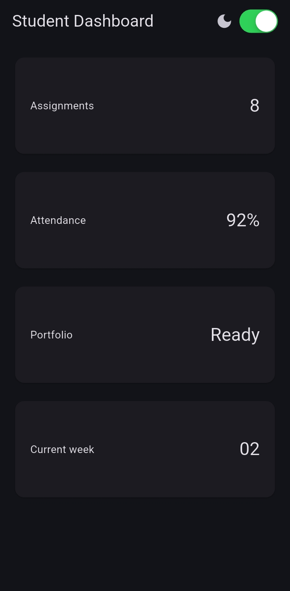<br>
`CupertinoSwitch` tetap bisa ditoggle (state `isDark` berubah, ikon ikut berganti), namun tampilan tema aplikasi tidak ikut berubah atau tetap gelap terus. Ini adalah bukti nyata prinsip **declarative UI**: `build()` menggambarkan UI berdasarkan konfigurasi yang di-*declare* saat itu (dalam kasus ini `ThemeMode.dark` yang di-hardcode), bukan berdasarkan histori interaksi pengguna. Setelah `themeMode` dikembalikan menjadi dinamis (`isDark ? ThemeMode.dark : ThemeMode.light`), switch dan tema kembali sinkron.

#### Eksperimen 3 - Uji aplikasi dengan ukuran layar emulator yang berbeda.
- Layar Potrait 
<br>
- Layar Landscape
<br>

#### Eksperimen 4 - Tambahkan Semantics atau label yang bermakna pada elemen yang penting bagi screen reader.
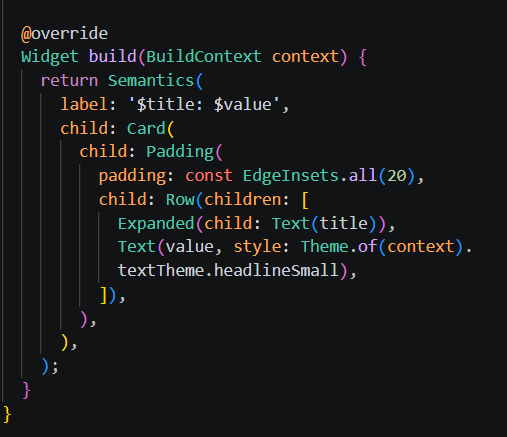<br>
- `DashboardCard` dibungkus `Semantics` dengan `label: '$title: $value'`, agar screen reader membaca `title` dan `value` sebagai satu kalimat utuh (misal "Assignments: 8"), bukan dua teks terpisah tanpa konteks.
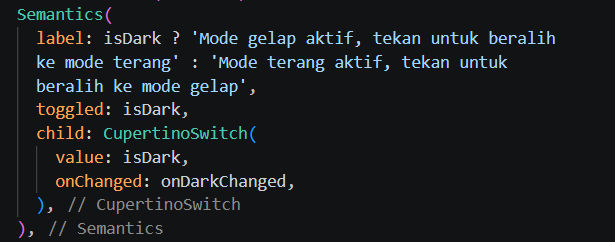<br>
- `CupertinoSwitch` dibungkus `Semantics` dengan `label` dinamis (menjelaskan status saat ini dan aksi yang akan terjadi jika ditekan) dan `toggled: isDark`, agar screen reader membacakan konteks yang jelas, bukan sekadar "switch".

#### Kesimpulan 
- `LayoutBuilder` memungkinkan UI merespons ukuran layar secara reaktif berdasarkan `constraints`, cocok untuk membangun layout responsif tanpa logic manual mendeteksi orientasi.
- Breakpoint harus dipilih sesuai target device, breakpoint yang terlalu rendah membuat layout lebar tampil pada layar yang sebenarnya sempit.
- `themeMode` yang di-hardcode memutus hubungan antara state UI dan tampilan tema. Menegaskan bahwa dalam declarative UI, tampilan akhir bergantung penuh pada apa yang dideklarasikan di `build()`.
- `Semantics` penting untuk aksesibilitas meski tidak berdampak visual, karena memberi konteks yang jelas bagi pengguna screen reader.

---
### Tugas dan AI design exploration
#### Tugas Utama Academic Overview
- Layar Sempit (Potrait) 
<br>
- Layar Lebar (Landscape)
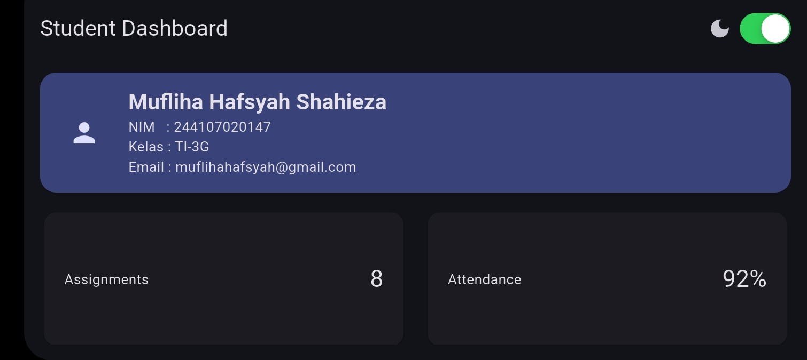<br>
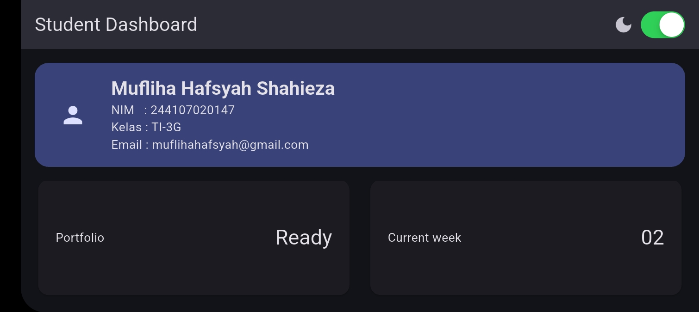<br>

---
#### AI Prompt Challenge
##### Prompt 1 — Prompt Desain

**Prompt yang diajukan:**
> "Bandingkan dua tata letak dashboard akademik untuk Flutter: versi `GridView` dan versi `LayoutBuilder` + `Column`. Jelaskan trade-off responsif dan aksesibilitasnya."

**Ringkasan output AI:**<br>
1. GridView:
- Kelebihan: otomatis scrollable kalau konten melebihi layar, crossAxisCount gampang diubah dinamis untuk kolom responsif, cocok untuk data seragam (kartu dengan bentuk/ukuran mirip).
- Trade-off: childAspectRatio itu tetap/fixed, jadi kalau konten salah satu kartu lebih panjang dari yang lain, bisa overflow atau keliatan aneh (ada ruang kosong berlebih). Untuk aksesibilitas, urutan fokus (Semantics) mengikuti urutan grid row-by-row, kadang kurang natural untuk screen reader dibanding susunan linear.
2. LayoutBuilder + Column:
- Kelebihan: lebih fleksibel mengatur ukuran tiap item secara individual (tidak harus seragam), transisi fokus untuk screen reader lebih predictable karena urutannya eksplisit sesuai kode.
- Trade-off: harus manual coding logic wrap ke baris baru sendiri (Wrap widget atau bikin Row bersarang dengan pengecekan index), lebih banyak boilerplate dibanding GridView yang sudah built-in grid logic-nya.
<br>

- **Keputusan yang dipilih:** Tetap menggunakan `GridView.count` seperti pada implementasi awal, karena kartu dashboard (`Assignments`, `Attendance`, `Portfolio`, `Current week`) berukuran seragam. Kelebihan `GridView` (built-in grid logic, scrollable otomatis) lebih relevan dibanding kebutuhan fleksibilitas ukuran item dari pendekatan manual.
- **Alasan teknis:** Konten dashboard bersifat homogen (semua kartu punya struktur `title` + `value` yang sama), sehingga trade-off `GridView` (aspect ratio tetap) tidak menjadi masalah nyata di kasus ini.

---
##### Prompt 2 — Prompt Penguatan Konsep

**Prompt yang diajukan:**
> "Jelaskan kapan penggunaan `Expanded` justru menyebabkan overflow di dalam `Row`, beri contoh kode yang gagal dan perbaikannya."

**Ringkasan output AI:**<br> 
- Expanded sebenarnya dirancang untuk mencegah overflow, bukan menyebabkannya. Tapi ada 1 skenario umum di mana Expanded justru bikin error, yaitu menggunakan lebih dari satu Expanded dengan total flex yang membutuhkan ruang lebih besar dari yang tersedia, dikombinasikan dengan child yang punya ukuran minimum tetap (misal Image dengan width fixed) di dalam Expanded itu sendiri. Hal ini menyebabkan "RenderFlex children have non-zero flex but incoming width constraints are unbounded", biasanya terjadi kalau Row itu sendiri diletakkan di dalam widget lain yang tidak memberi batas lebar (misal di dalam ListView horizontal atau SingleChildScrollView horizontal tanpa constraint).
- Contoh kode yang gagal: 
```dart
SingleChildScrollView(
  scrollDirection: Axis.horizontal,
  child: Row(
    children: [
      Expanded(child: Text('Item 1')), // ERROR: Expanded butuh bounded width
    ],
  ),
)
```
<br>
Error ini muncul karena SingleChildScrollView horizontal memberi lebar unbounded (tak terbatas) ke child-nya, sedangkan Expanded butuh tahu batas lebar yang jelas untuk membagi ruang.

- Perbaikan dilakukan dengan mengganti Expanded dengan lebar tetap, atau hilangkan scroll horizontal kalau tidak perlu:
```dart
SingleChildScrollView(
  scrollDirection: Axis.horizontal,
  child: Row(
    children: [
      SizedBox(width: 200, child: Text('Item 1')), // aman, lebar eksplisit
    ],
  ),
)
```
<br>

- **Keputusan yang dipilih:** Tidak diterapkan langsung ke project (karena dashboard kita tidak menggunakan `Row` di dalam scroll horizontal), namun dicatat sebagai referensi konsep. Jika suatu saat dibutuhkan, solusi yang lebih tepat adalah `Flexible` + `ConstrainedBox(maxWidth: ...)`, bukan `SizedBox` fixed-width, agar tetap adaptif di layar sempit.
- **Alasan teknis:** `Flexible` tidak memaksa child mengambil ruang penuh seperti `Expanded`, dan `ConstrainedBox` memberi batas maksimum tanpa memaksa lebar minimum, kombinasi ini lebih aman untuk berbagai ukuran layar dibanding lebar tetap (hardcoded).

---
##### Prompt 3 — Verification Prompt 

**Prompt yang diajukan:**
> "Periksa kembali rekomendasi layout di atas: apakah tetap responsif di bawah 600px, apakah mengurangi aksesibilitas, dan apakah ada widget yang tidak tersedia di Flutter stabil saat ini?"

**Hasil audit:**<br>
1. **Responsif di bawah 600px?** 
- Rekomendasi GridView di Prompt 1: ya, tetap responsif. breakpoint kita (700px) sudah menghasilkan 1 kolom di bawah 600px, dan childAspectRatio: 2.6 masih proporsional untuk lebar HP standar (~360-430px).
- Solusi Prompt 2 (SizedBox(width: 200, ...) untuk mengganti Expanded): ini berpotensi masalah di layar sangat sempit (<400px) karena lebar tetap 200px bisa jadi proporsi terlalu besar dari total lebar layar. Perbaikan yang lebih aman: pakai ConstrainedBox(constraints: BoxConstraints(maxWidth: 200)) dengan Flexible (bukan Expanded), supaya tetap bisa mengecil di layar sempit tanpa error unbounded width.
<br>

2. **Mengurangi aksesibilitas?** 
- Tidak ada rekomendasi yang mengurangi atau menghapus `Semantics` yang sudah diterapkan pada `DashboardCard` dan `CupertinoSwitch`.
<br>

3. **Apakah ada widget yang tidak tersedia di Flutter stabil saat ini?** 
- Semua widget yang direkomendasikan (`GridView`, `LayoutBuilder`, `Expanded`, `Flexible`, `ConstrainedBox`, `SizedBox`) adalah widget inti Flutter stable, tidak ada yang eksperimental atau deprecated.

**Bukti verifikasi:** 
<br>
<br>
<br>
Screenshot di atas membuktikan bahwa keputusan akhir (tetap pakai `GridView.count` dengan breakpoint `700px`, sesuai hasil diskusi Prompt 1) sudah diuji nyata: 1 kolom pada layar sempit, 2 kolom pada layar lebar, bukan sekadar klaim teori dari AI. 

---
#### Refactoring challenge
**Hasil Refactoring:**
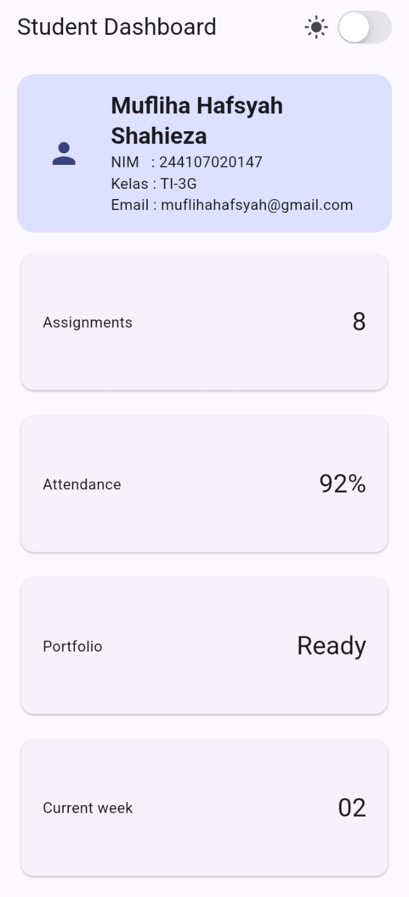<br>

Setelah Tugas Utama berjalan, dilakukan pembersihan kode dengan 3 penyesuaian:

1. **Ekstrak widget reusable** 
- `DashboardCard` di-rename menjadi `InfoCard` agar konsisten dengan istilah pada modul. Widget ini menerima `title` dan `value`, dan sudah dipakai berulang di `GridView` tanpa duplikasi struktur widget.
2. **Warna mengikuti tema** 
- seluruh warna (background `ProfileHeader`, tema aplikasi) menggunakan `Theme.of(context).colorScheme...` atau `colorSchemeSeed`, tidak ada warna hardcode yang mengabaikan light/dark theme.
3. **Breakpoint dipindah ke konstanta bernama:**
```dart
   const kWideBreakpoint = 700;
```
<br>digunakan pada `LayoutBuilder`:

```dart
   final columns = constraints.maxWidth >= kWideBreakpoint ? 2 : 1;
```
<br>sehingga breakpoint hanya didefinisikan satu kali dan mudah diubah di masa depan.

4. **`flutter analyze`** dijalankan setelah refactor 
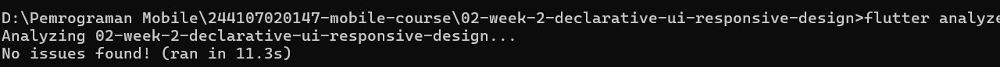<br>
- hasil **No issues found!**, tidak ada error maupun warning baru. Tampilan aplikasi diverifikasi identik dengan sebelum refactor (perilaku tidak berubah, hanya struktur kode yang lebih rapi).
---
#### Testing dasar
Hasil pengujian:<br>
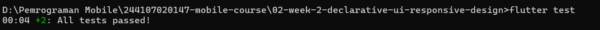<br>
Kedua test lulus (`All tests passed!`), membuktikan bahwa lebar `Card` di layar sempit (400px) selalu kurang dari 700px, dan di layar lebar (1200px) selalu lebih dari 500px, sesuai perilaku responsif yang diharapkan.
---
#### Checklist verifikasi
1. flutter analyze tidak menghasilkan error.
bukti *screenshot* : <br>
<br>
2. flutter test lulus semua widget test responsif.
bukti *screenshot* : <br>
<br>
3. Aplikasi dapat dijalankan pada ukuran layar sempit dan lebar.
bukti *screenshot* : <br>
- Layar Sempit (Potrait) 
<br>
- Layar Lebar (Landscape)
<br>
<br>
4. Dark mode memiliki kontras dan teks yang terbaca.
bukti *screenshot* : <br>
<br>
5. Struktur widget dapat dijelaskan saat code review.
Struktur widget pada project ini:
- `DashboardApp` (`StatefulWidget`): root aplikasi, menyimpan state `isDark` dan mengatur `themeMode`.
- `DashboardPage`: berisi `AppBar` (dengan toggle `CupertinoSwitch`) dan `LayoutBuilder` untuk grid responsif.
- `ProfileHeader`: kartu profil di bagian atas dashboard.
- `InfoCard`: widget reusable untuk tiap kartu informasi (`title` + `value`), dipakai 4 kali di dalam `GridView.count`.
6. Screenshot, folder test/, dan README sudah tersimpan pada folder tugas Week 2.
bukti *screenshot* : <br>
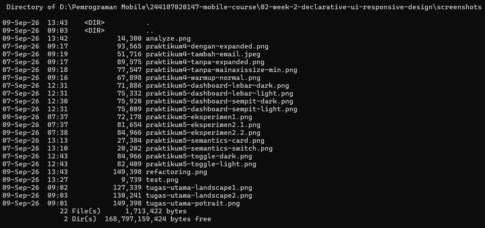<br>
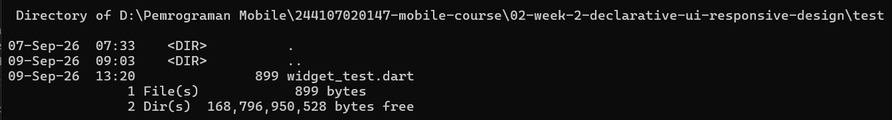<br>
---
### Refleksi
1. **Apa perbedaan cara berpikir imperative dan declarative saat membangun UI?**<br>
Jawaban:<br>
Dalam pendekatan imperative, kita harus menulis langkah demi langkah bagaimana UI berubah, misalnya "cari elemen ini, lalu ubah warnanya, lalu update tampilannya". Sedangkan dalam declarative (seperti Flutter), kita cukup mendeskripsikan *seperti apa* UI seharusnya terlihat berdasarkan state saat ini, dan framework yang mengurus bagaimana cara mengubah tampilannya. Ini terasa jelas saat membuat `CupertinoSwitch` untuk toggle dark mode, saya tidak perlu menulis kode untuk "mengubah warna background secara manual", cukup ubah state `isDark` lewat `setState`, dan seluruh `build()` otomatis dipanggil ulang dengan `themeMode` yang sesuai.
2. **Kapan Expanded membantu dan kapan penggunaannya justru menghasilkan layout error?**<br>
Jawaban:<br>
- `Expanded` membantu ketika kita ingin sebuah widget mengisi sisa ruang yang tersedia di dalam `Row`/`Column`, sekaligus mencegah overflow karena `Expanded` memberi batas lebar/tinggi yang jelas ke child-nya. Saya membuktikan ini langsung di Praktikum 4: tanpa `Expanded`, nama yang panjang menyebabkan overflow (garis kuning-hitam), sedangkan dengan `Expanded`, teks otomatis wrap ke baris berikutnya karena mendapat batas lebar yang jelas.
- Namun `Expanded` justru menyebabkan error jika diletakkan di dalam widget yang memberi ruang tak terbatas (unbounded), misalnya `Row` di dalam `SingleChildScrollView` dengan `scrollDirection: Axis.horizontal`. Dalam kasus ini, `Expanded` tidak tahu harus membagi ruang seberapa besar, sehingga Flutter melempar error "RenderFlex children have non-zero flex but incoming width constraints are unbounded".

3. **Bagaimana breakpoint dan theme memengaruhi pengalaman pengguna?**<br>
Jawaban:<br>
- Breakpoint menentukan kapan layout berubah struktur (1 kolom vs 2 kolom) berdasarkan lebar layar. Breakpoint yang tepat (misalnya 700px pada dashboard ini) memastikan tampilan tetap nyaman dibaca di HP maupun tablet. Saya mencoba menurunkan breakpoint ke 350px sebagai eksperimen, dan hasilnya kartu menjadi terlalu sempit meski masih di layar HP. Hal ini menunjukkan breakpoint yang tidak sesuai target device bisa merusak pengalaman membaca, meskipun secara teknis kode tetap "responsif".
- Sementara itu, theme (light/dark) memengaruhi kenyamanan visual, terutama kontras teks terhadap background dan konsistensi warna di seluruh aplikasi. Karena warna diambil dari `Theme.of(context).colorScheme`, transisi antara light dan dark mode tetap konsisten tanpa perlu mengatur ulang warna di tiap widget secara manual.

4. **Apa yang Anda verifikasi dari rekomendasi AI setelah tugas inti selesai?**<br>
Jawaban:<br>
Setelah mendapat rekomendasi AI soal perbandingan `GridView` vs `LayoutBuilder`+`Column` manual, dan solusi untuk masalah `Expanded` di dalam scroll horizontal, saya memverifikasi tiga hal: 
- apakah rekomendasi tetap responsif di layar sempit (di bawah 600px) dengan mengecek langsung lewat screenshot potret HP
- apakah rekomendasi tersebut mengurangi aksesibilitas yang sudah saya bangun lewat `Semantics`
- apakah semua widget yang disebutkan AI benar-benar tersedia di Flutter versi stable, bukan API eksperimental. <br>
Dari verifikasi ini, saya menemukan satu rekomendasi awal AI (`SizedBox` fixed-width) kurang tepat untuk layar sangat sempit, sehingga saya revisi menjadi `Flexible` + `ConstrainedBox` yang lebih adaptif, ini menegaskan bahwa saran AI tetap perlu diuji ulang terhadap kondisi nyata proyek, bukan diterima mentah-mentah.
---