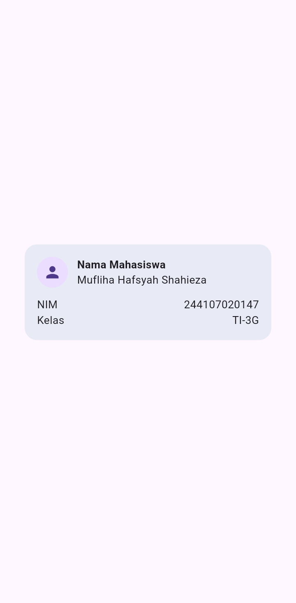
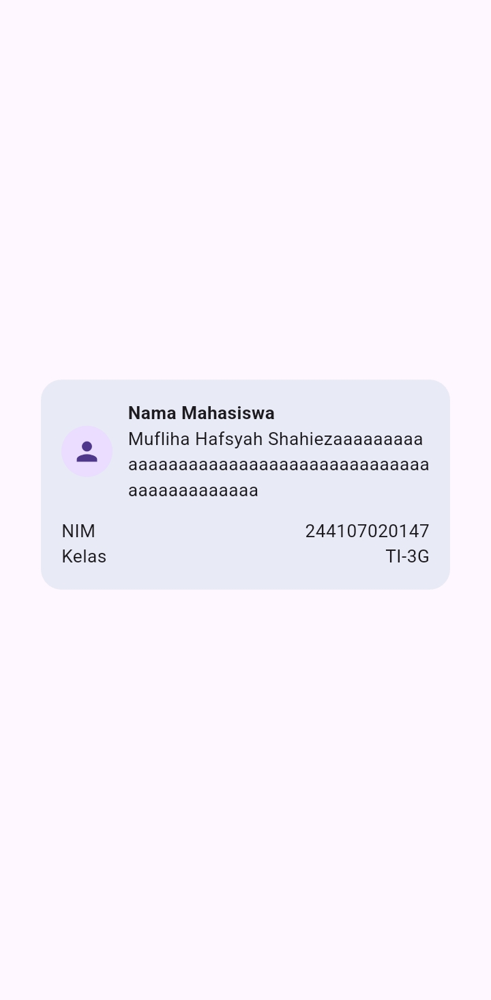
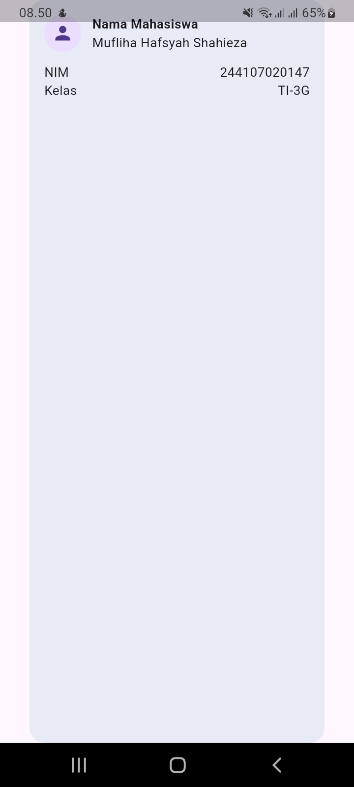

# LAPORAN PRAKTIKUM - WEEK 2 PEMROGRAMAN MOBILE

## Identitas Mahasiswa

| Keterangan | Detail |
|---|---|
| Nama | Mufliha Hafsyah Shahieza |
| NIM | 244107020147 |
| Kelas | TI-3G |

---

## JOBSHEET WEEK 2
**Declarative UI & Responsive Design**

### Hasil Praktikum: layout sederhana (warm-up)

#### Kondisi normal (setelah data diisi)
  

Kartu tampil rapi, terpusat di layar, dengan avatar, nama, NIM, dan Kelas sesuai pola `Row` + `Expanded`.

#### Eksperimen 1 — Menghapus Expanded pada baris nama
 

Ketika teks nama diperpanjang secara signifikan, muncul garis kuning-hitam (overflow warning).

**Analisis:**  
Tanpa `Expanded`, `Row` memberi `Column` di dalamnya ukuran *natural/unconstrained*, dia mencoba menampilkan kontennya selebar yang dibutuhkan, bukan dibatasi sisa ruang yang tersedia. Jika lebar natural itu melebihi sisa ruang di `Row`, terjadi overflow karena `Row` tidak bisa memaksa child mengecil tanpa `Expanded` atau `Flexible`. 

 
Sebaliknya, dengan `Expanded`, `Row` membatasi lebar `Column` sesuai sisa ruang yang tersedia. Karena `Text` secara default bisa wrap, begitu lebarnya dibatasi, teks otomatis pindah ke baris berikutnya (multi-line) alih-alih meluber keluar batas layout.

#### Eksperimen 2 — Menghapus mainAxisSize: MainAxisSize.min
 

**Analisis:**  
`MainAxisSize.min` membuat `Column` hanya meminta tinggi minimum yang dibutuhkan kontennya. Setelah dihapus, default-nya menjadi `MainAxisSize.max`, sehingga `Column` mengambil seluruh tinggi yang tersedia dari parent (`Container` yang dipusatkan dalam `Scaffold` seukuran layar). Akibatnya, kartu melebar mengisi seluruh tinggi layar meski isinya hanya beberapa baris teks.  
Hal ini menunjukkan pentingnya `MainAxisSize.min` ketika kita ingin sebuah container/kartu membungkus rapat kontennya, bukan ikut memenuhi ruang parent yang jauh lebih besar.

#### Eksperimen 3 — Menambahkan Baris Data (Email)
 

**Analisis:** 
Pola `Row` + `Expanded` bersifat reusable, menambah baris data baru cukup dengan menduplikasi struktur yang sama tanpa mengubah bagian lain. Tinggi kartu bertambah otomatis mengikuti jumlah konten karena `MainAxisSize.min` masih aktif.

#### Kesimpulan 
- `Expanded` di dalam `Row`/`Column` berfungsi memberi batas ruang (constraint) ke child-nya, mencegah overflow sekaligus memungkinkan teks untuk wrap ketika kontennya panjang.
- `MainAxisSize.min` penting digunakan ketika sebuah `Column`/`Row` harus membungkus rapat kontennya, bukan ikut memenuhi ruang parent yang lebih besar.
kut memenuhi ruang parent yang lebih besar.
- Pola `Row` + `Expanded` (label kiri, value kanan) bersifat reusable untuk menambah baris data baru tanpa perlu mengubah struktur widget lainnya.

---