# LAPORAN PRAKTIKUM - WEEK 3 PEMROGRAMAN MOBILE

## Identitas Mahasiswa

| Keterangan | Detail |
|---|---|
| Nama | Mufliha Hafsyah Shahieza |
| NIM | 244107020147 |
| Kelas | TI-3G |

---

## JOBSHEET WEEK 3 Navigation & State Management

---
### Praktikum 1 — Aplikasi Multi-page dengan GoRouter
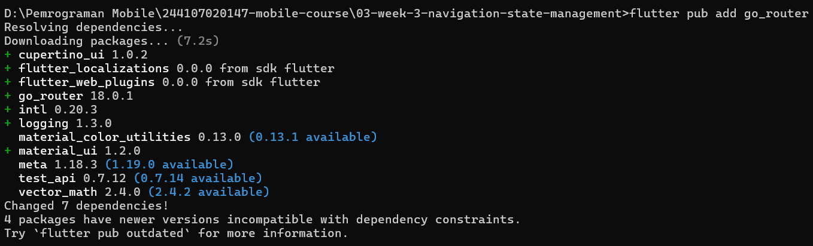<br><br>
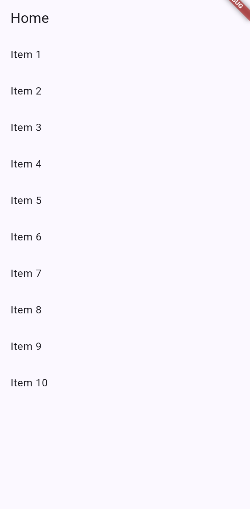<br><br>
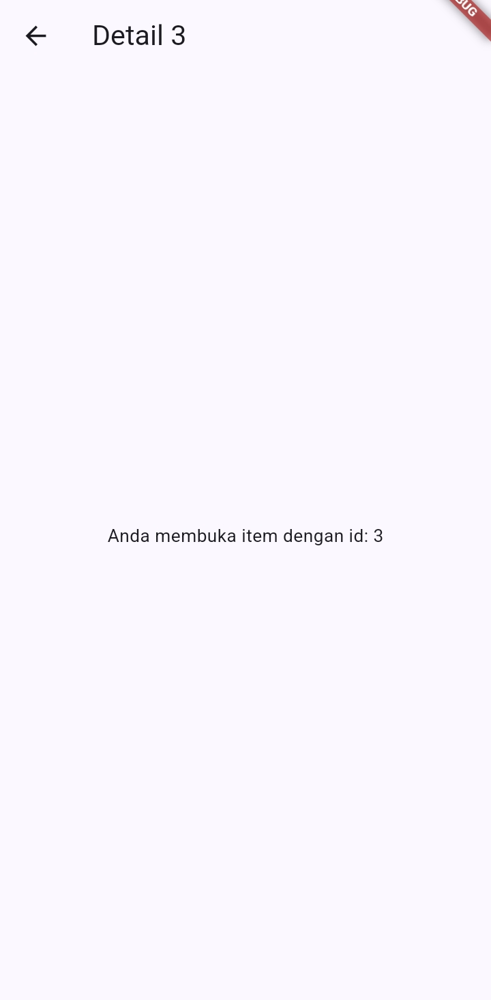<br>

**Analisis:**<br>
Saat item ditekan, path berpindah dari `/` ke `/detail/:id` sesuai id item yang dipilih. Tombol back pada sistem secara otomatis mengarahkan kembali ke Home karena GoRouter mengelola stack navigasi berdasarkan struktur `routes` (nested route `detail/:id` di bawah `/`). Dibandingkan Navigator 1.0, pendekatan ini membuat struktur route lebih terorganisir dan mendukung deep link (akses langsung ke path tertentu tanpa harus melewati Home terlebih dahulu).

---

### Praktikum  2 — Aplikasi ToDo dengan Riverpod

**Kondisi awal (kosong):**<br>
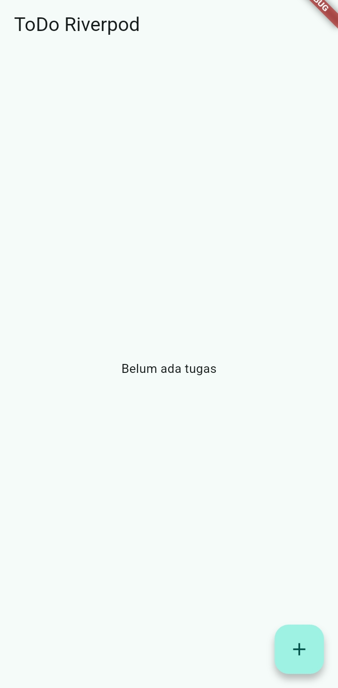<br><br>
**Dialog tambah tugas:**<br>
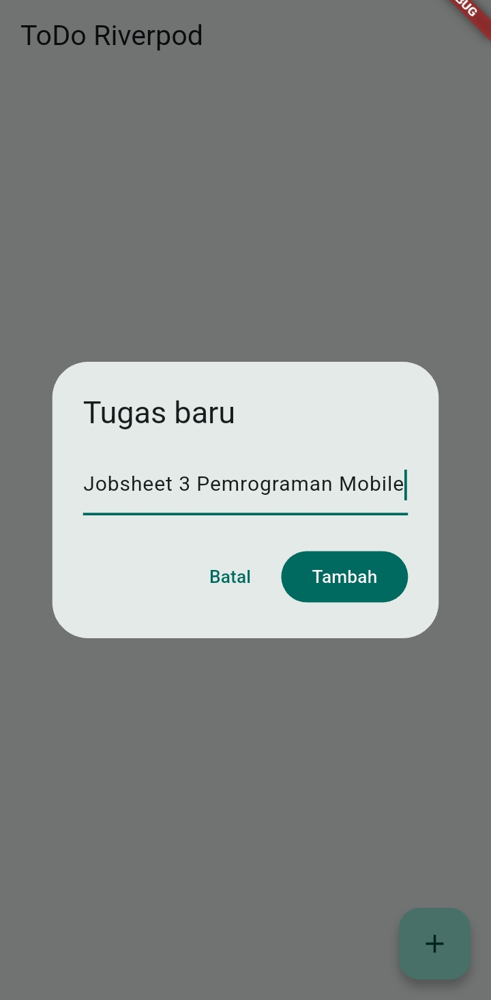<br><br>
**List terisi:**<br>
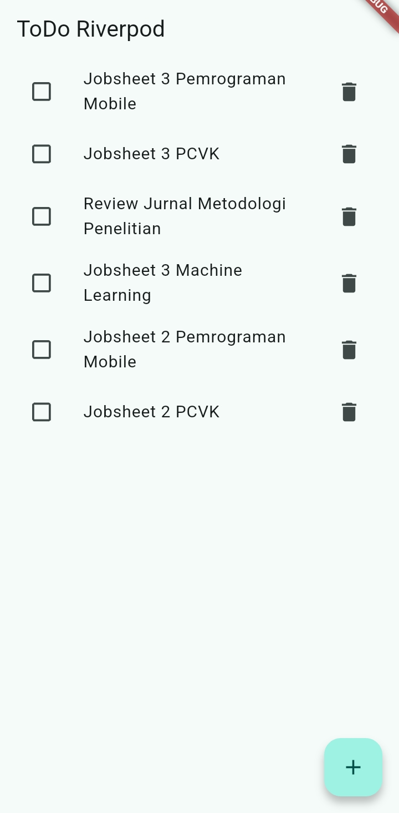<br><br>
**Tugas dicentang (selesai):**<br>
<br><br>
**Tugas dihapus:**
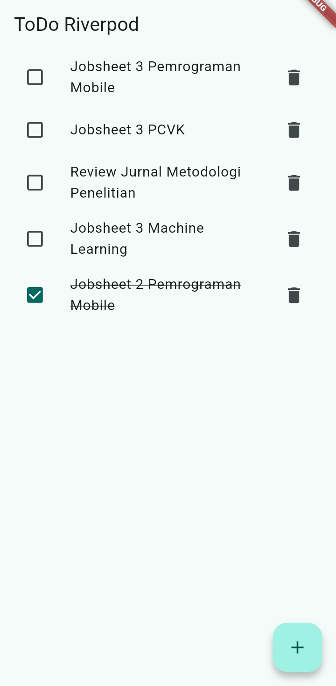<br><br>

**Analisis:**<br>
- `ref.watch` yang dipanggil di dalam `build` menyebabkan `TodoPage` melakukan pembangunan ulang (rebuild) secara otomatis setiap kali `state` pada `TodoListNotifier` mengalami perubahan, baik akibat penambahan, pengubahan status (toggle), maupun penghapusan tugas. Hal ini merupakan konsekuensi dari prinsip *UI deklaratif = f(state)*, di mana tampilan antarmuka selalu merepresentasikan state terkini secara konsisten.
- Sebaliknya, `ref.read` yang digunakan di dalam callback (`onPressed`, `onChanged`) hanya melakukan pemanggilan method notifier satu kali tanpa mendaftarkan widget untuk menerima notifikasi perubahan state selanjutnya. Pendekatan ini mencegah terjadinya pembangunan ulang widget yang tidak diperlukan pada saat callback dieksekusi.
- Poin penting yang telah diverifikasi adalah bahwa seluruh method pada `TodoListNotifier` (`add`, `toggle`, `remove`) senantiasa menghasilkan objek atau list yang baru (`[...state, ...]`, `copyWith`, `[...state]..removeAt(...)`), bukan memodifikasi `state` secara langsung. Hal ini bersifat krusial karena Riverpod mendeteksi perubahan berdasarkan perbedaan referensi objek, bukan berdasarkan mutasi internal pada objek yang sama.

---
### Praktikum  3 — Menangani State Asinkron dengan AsyncValue
**Tampilan loading selama 2 detik pertama:**<br>
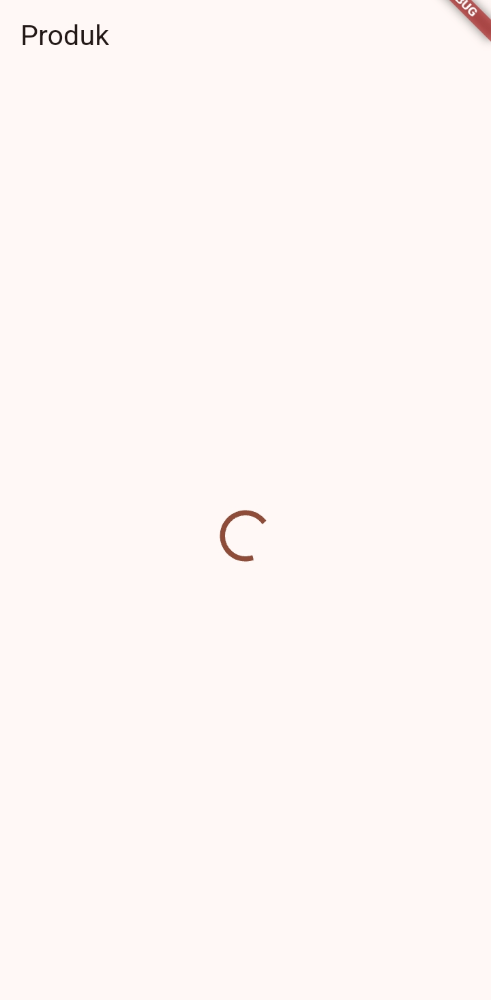<br><br>
**Tampilan sukses:**<br>
<br><br>
**Tampilan error beserta tombol Coba lagi:**<br>
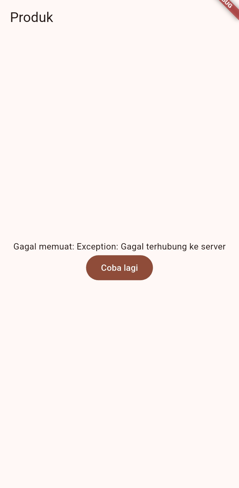<br><br>

**Analisis:**<br>
- `AsyncValue` memodelkan ketiga kemungkinan state (loading, error, success) dalam satu tipe data, sehingga UI cukup menggunakan satu method `.when()` untuk menentukan tampilan yang sesuai, tanpa perlu mengelola beberapa flag boolean (`isLoading`, `hasError`) secara manual yang berisiko menghasilkan kombinasi kondisi yang tidak konsisten.<br><br>

**Refleksikan: mengapa menampilkan ulang data lama (stale data) dengan indikator refresh kadang lebih baik daripada mengosongkan layar? Kapan pola itu penting?**<br>
Jawaban:<br>
- Menampilkan data lama (*stale data*) sambil memberi indikator refresh membuat pengguna tetap mengetahui bahwa aplikasi sedang bekerja (loading), bukan mengalami macet atau lag. Data lama tetap terlihat di layar sehingga pengguna tidak merasa kebingungan karena layar tiba-tiba kosong, dan mereka dapat menunggu dengan tenang sampai data baru selesai dimuat, sambil tetap dapat melihat atau menggunakan data lama untuk sementara waktu. Pola ini penting terutama pada aplikasi yang sering melakukan proses refresh (misalnya *pull-to-refresh* pada daftar produk atau notifikasi), karena mengosongkan layar setiap kali refresh dilakukan akan terasa mengganggu dan membuat pengalaman pengguna terasa tidak stabil.

---

### AI Challenge

Dokumentasi lengkap proses AI Prompt Challenge dapat dilihat di:<br>

📄 [docs/ai-verification.md](docs/ai-verification.md)<br>

**Ringkasan:**<br> 
AI digunakan untuk membuat `StatsPage` dengan `AsyncNotifierProvider` sesuai prompt pada modul. Setelah diverifikasi menggunakan AI Verification Checklist, ditemukan bahwa kode AI secara struktural sudah benar (immutability, pola `ref.watch`/`ref.read`, penanganan tiga state `AsyncValue`), namun unit test yang diberikan bersifat *flaky* (tidak deterministik) dan mengalami race condition saat pengujian skenario error. Diperlukan tiga iterasi perbaikan sebelum kode benar-benar lolos `flutter analyze` dan `flutter test` tanpa masalah.

--- 

### Refactoring dan testing

1. **Pisahkan widget bar ToDo menjadi TodoTile tersendiri agar build lebih pendek dan mudah diuji.**<br>
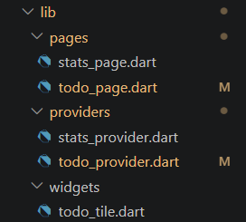<br><br>
2. **Ekstrak logika filter (misal tampilkan hanya yang belum selesai) menjadi Provider turunan yang membaca todoListProvider.**<br>
- halaman ToDo, toggle OFF, semua tugas (termasuk yang selesai) tampil.<br>
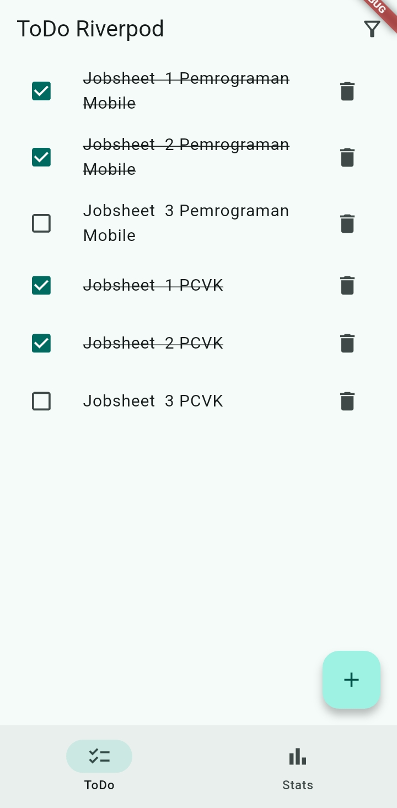<br><br>
- halaman ToDo, toggle ON, hanya tugas belum selesai yang tampil, icon di AppBar berubah.<br>
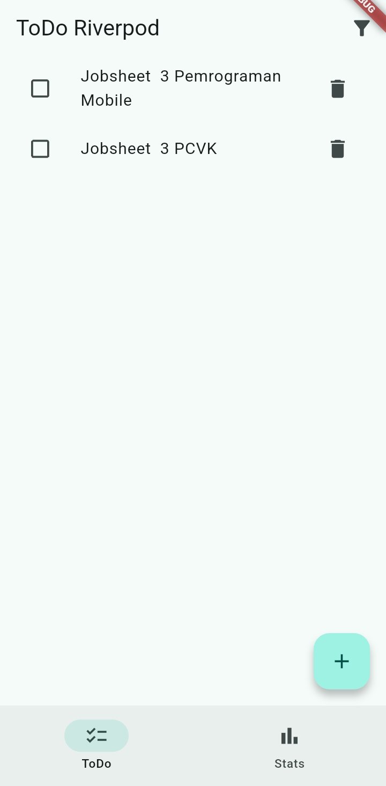<br><br>
3. **Integrasikan aplikasi ToDo dengan GoRouter: / untuk daftar dan /stats untuk halaman statistik, tambahkan NavigationBar untuk berpindah.**<br>
- tampilan saat di tab ToDo<br>
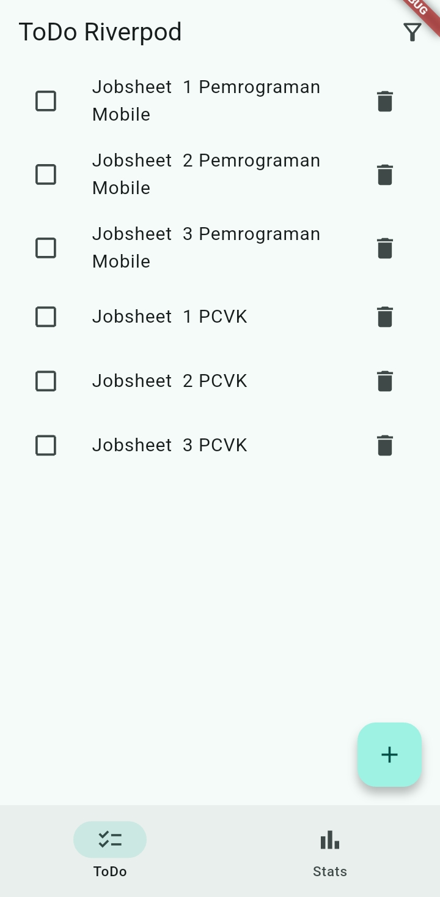<br><br>
- tampilan saat di tab Stats<br>
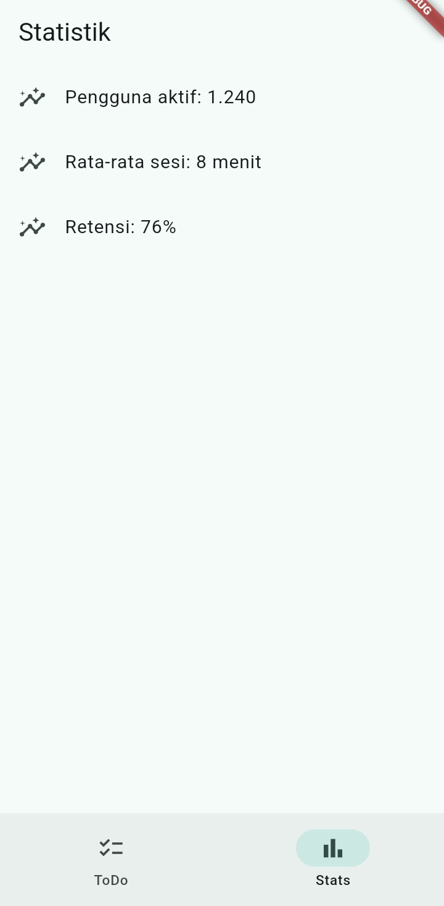<br><br>


#### Checklist verifikasi mandiri:<br>
1. **Navigasi GoRouter bekerja: pindah halaman, back, dan akses path detail langsung.**<br>
<br><br>
<br><br>

2. **ProviderScope membungkus root aplikasi; state ToDo bertahan saat berpindah halaman.**<br>
**Kondisi awal (kosong):**<br>
<br><br>
**Dialog tambah tugas:**<br>
<br><br>
**List terisi:**<br>
<br><br>
**Tugas dicentang (selesai):**<br>
<br><br>
**Tugas dihapus:**
<br><br>

3. **UI AsyncValue menangani loading, error, dan success, bukan hanya success.**<br>
**Tampilan loading selama 2 detik pertama:**<br>
<br><br>
**Tampilan sukses:**<br>
<br><br>
**Tampilan error beserta tombol Coba lagi:**<br>
<br><br>

4. **flutter analyze tanpa issue dan semua test lulus.** <br>
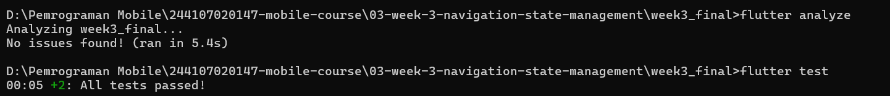<br><br> 

5. **Hasil AI diverifikasi dan didokumentasikan pada folder docs/.**
📄 [docs/ai-verification.md](docs/ai-verification.md)<br>

--- 
### Tugas, refleksi, dan referensi

#### Mini project / Industry Challenge
**Halaman Daftar Tugas:**<br> 
- Belum ada tugas<br>
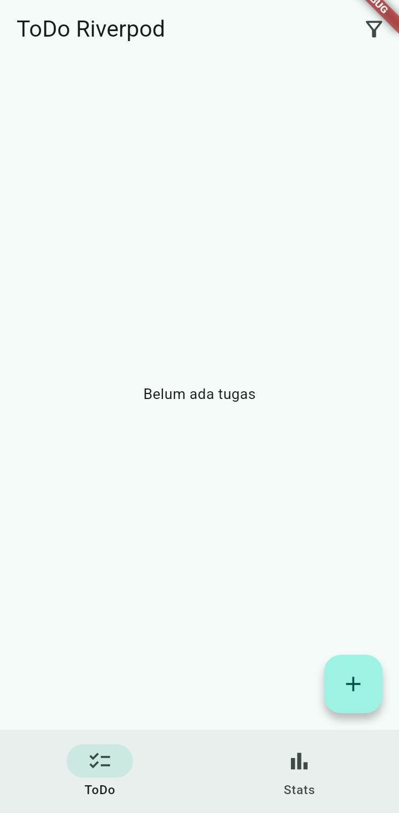<br><br> 
- Menambahkan tugas<br> 
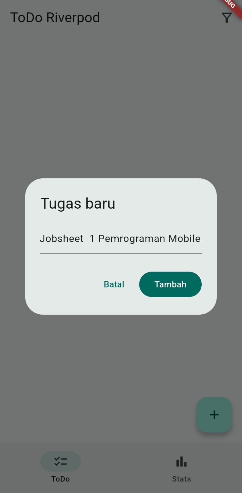<br><br> 
- Daftar tugas<Br>
<br><br>
- Menandai tugas yang sudah selesai<br>  
<br><br> 
- Hanya menampilkan tugas yang sudah selesai<br>
<br><br> 
- Menghapus salah satu tugas<br>
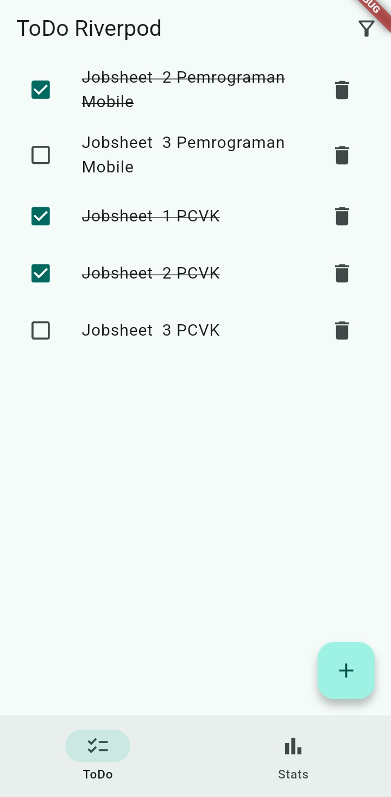<br><br>   

**Halaman Statistik**<br> 
- Tampilan halaman statistik sedang loading<br>
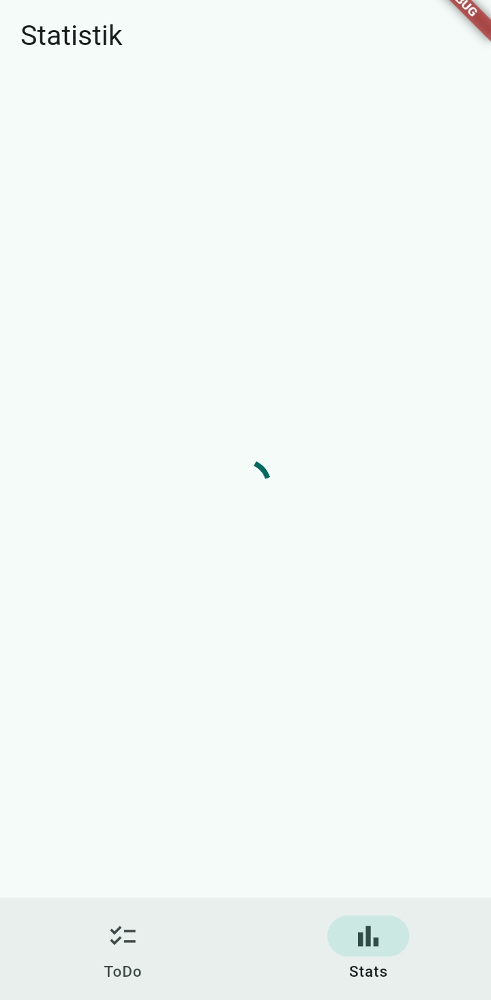<br><br>   
- Tampilan halaman statistik sukses<br>
<br><br>   
- Tampilan halaman statistik error<br>
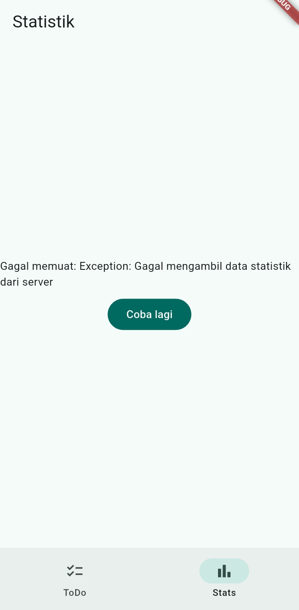<br><br>   

#### Refleksi 
1. **Kapan setState masih cukup, dan kapan state harus naik ke Riverpod?**<br>
Jawaban:<br>
**setState masih cukup ketika:**
- State bersifat ephemeral (lokal/sementara) dan hanya dibutuhkan oleh satu widget itu sendiri (UI state).
- Contoh: Mengontrol status centang (checkbox), membuka/menutup dialog/dropdown, mengubah visibilitas teks kata sandi (toggle password visibility), atau mengontrol animasi lokal.
- State tersebut tidak perlu disimpan saat berpindah halaman dan tidak diakses oleh widget lain di pohon (widget tree).<br>

**State harus naik ke Riverpod ketika:**
- State bersifat shared (global/aplikasi) atau dipake bersama oleh beberapa widget/halaman yang berbeda.
- State berhubungan dengan logika bisnis atau komunikasi data (API call, database, autentikasi pengguna).
- State perlu bertahan (persist) meskipun pengguna melakukan navigasi berpindah halaman (misalnya: data profil pengguna, daftar item di dalam keranjang belanja).
- Ingin memisahkan antara tampilan (UI) dan logika (separation of concerns) agar kode mudah diuji (testable).<br>

2. **Apa perbedaan context.go dan context.push, dan kapan masing-masing tepat digunakan?**<br>
Jawaban:<br>
**Perbedaan Utama**<br>
**context.go (Declarative Routing):**
- Mekanisme: Memperbarui lokasi URL dan menyusun ulang tumpukan navigasi (navigation stack) sesuai dengan hierarki rute yang dideklarasikan pada GoRouter.
- Perilaku Tumpukan: Mengganti tumpukan halaman saat ini. Saat pengguna menekan tombol Back, aplikasi akan membawa pengguna ke halaman parent sesuai struktur rute yang didefinisikan, bukan selalu halaman yang dibuka tepat sebelumnya.<br>

**context.push (Imperative Routing):**
- Mekanisme: Menambahkan (push) halaman baru secara langsung ke paling atas tumpukan navigasi tanpa mengubah struktur hierarki rute utama.
- Perilaku Tumpukan: Menumpuk layar baru di atas layar saat ini. Tombol Back akan selalu mengembalikan pengguna ke halaman persis sebelum fungsi push dipanggil.<br>

**Kapan Tepat Digunakan?**<br>
**Gunakan context.go ketika:**
- Menavigasi alur utama aplikasi, seperti perpindahan antar tab utama (Beranda, Cari, Profil).
- Setelah alur autentikasi berhasil (misalnya: dari Halaman Login berpindah ke /home), sehingga pengguna tidak bisa menekan tombol Back untuk kembali ke layar Login.
- Struktur navigasi sangat bergantung pada hierarki URL (deep linking).<br>

**Gunakan context.push ketika:**
- Membuka alur sub-halaman temporary/detail (misalnya: dari daftar item mengklik satu item untuk melihat DetailProdukScreen).
- Ingin memastikan tombol Back pada AppBar atau navigasi sistem secara pasti membawa pengguna kembali ke halaman pemanggilnya.
- Ingin menerima/menunggu nilai kembalian (return value) dari halaman baru yang dibuka, misalnya:
```dart
final result = await context.push('/select-category');
```
<br>

3. **Bagaimana AsyncValue mencegah bug dibanding tiga boolean terpisah?**<br>
Jawaban:<br>
**Masalah 3 Boolean Terpisah (isLoading, isError, hasData):**
- Risiko Invalid State (State Tidak Valid): Mudah terjadi kondisi logika yang saling bertentangan secara tidak sengaja (impossible states), seperti isLoading = true sekaligus hasData = true dan isError = true.
- Pemeriksaan Kompleks: Pengembang harus membuat banyak cabang penkondisian if-else manual yang rawan terlewat.<br>

**Solusi AsyncValue dari Riverpod:**
- Menggunakan konsep Pattern Matching / Sealed Class (AsyncData, AsyncLoading, AsyncError).
- Mencegah Bug: State dijamin mutually exclusive (hanya bisa berada pada SATU kondisi dalam satu waktu: sedang loading, berhasil membawa data, atau error).
- Sintaks yang Aman (.when atau .maybeWhen): Memaksa kamu untuk menangani ketiga skenario tersebut (loading, error, data) secara eksplisit di layer UI, sehingga tidak ada kondisi penanganan kesalahan (error handling) yang terlewat.<br>

4. **Bagian mana dari hasil AI yang Anda perbaiki, dan mengapa?**<Br>
Jawaban:<br>
Secara umum, kode UI dan provider hasil AI sudah baik. Namun, saya melakukan dua perbaikan utama pada Notifier dan Unit Test karena tidak lolos flutter test:<br>
**Memperbaiki Test yang Flaky (Acak) pada StatsNotifier:**
- Yang Diperbaiki: Menerapkan Dependency Injection (StatsFetcher) pada StatsNotifier.
- Mengapa: Kode asli AI menggunakan Random().nextDouble() langsung di dalam notifier, sehingga test gagal/lolos secara acak. Dengan dependency injection, data simulasi bisa dikontrol (mock) secara konsisten saat testing.<br>

**Mengatasi Race Condition (StateError) saat Testing State Error:**
- Yang Diperbaiki: Mengubah alur tes dari expectLater(..., throwsException) / try-catch menjadi pendekatan container.listen() dan mengecek state.hasError secara langsung setelah memberi jeda event loop Future.delayed(Duration.zero).
- Mengapa: Pembacaan statsProvider.future milik AI berbenturan dengan siklus dispose container sehingga memicu StateError: provider was disposed during loading state.

---