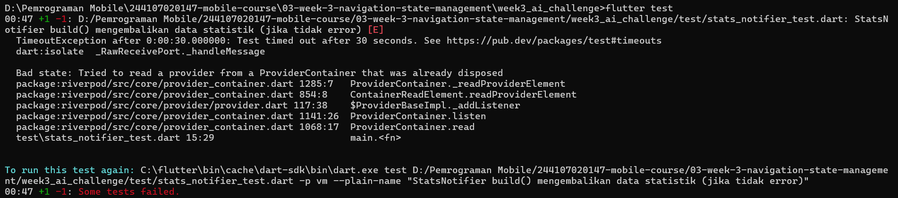
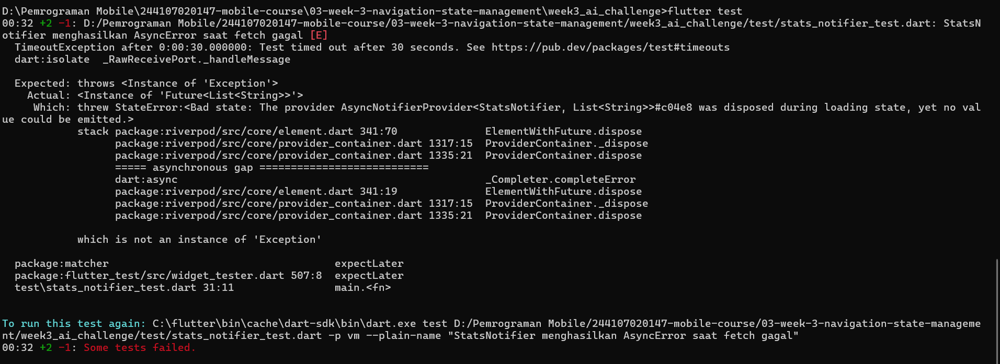
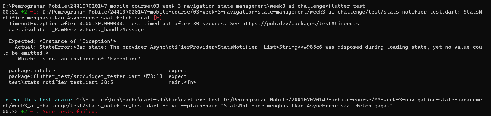
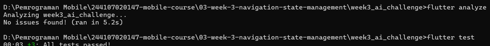

## AI Challenge

---

### AI Prompt Challenge
**Prompt yang Digunakan:**

```
Buatkan halaman Flutter bernama StatsPage menggunakan flutter_riverpod.
Requirements:
- ConsumerWidget dengan satu AsyncNotifierProvider yang mensimulasikan
  pengambilan data statistik (delay 2 detik, kadang gagal 30%).
- UI harus menangani loading (spinner), error (pesan + tombol retry),
  dan success (ListView 3 item).
- Berikan unit test untuk notifier-nya.
Jelaskan setiap bagian kode dalam komentar.
```

AI yang digunakan: Claude (chat assistant), digunakan sebagai co-developer sesuai kebijakan AI pada modul minggu ini.

---

### Output Awal AI

AI menghasilkan 3 file:
1. `lib/providers/stats_provider.dart` — `StatsNotifier extends AsyncNotifier<List<String>>` dengan simulasi gagal 30% menggunakan `Random().nextDouble()`.
2. `lib/pages/stats_page.dart` — `StatsPage extends ConsumerWidget` dengan `.when()` untuk loading/error/data.
3. `test/stats_notifier_test.dart` — 1 unit test yang membaca `statsProvider.future` lalu mengecek tipe `AsyncValue`.

---

### Verifikasi menggunakan AI Verification Checklist

| Poin Checklist | Hasil Verifikasi |
|---|---|
| Apakah state diubah secara immutable (tidak ada state.add() atau mutasi list langsung)? | Ya, `refresh()` selalu meng-assign `state` dengan objek baru (`AsyncLoading()`, hasil `AsyncValue.guard`), tidak ada mutasi langsung. |
| Apakah `ref.watch` hanya dipakai di dalam `build`, dan `ref.read` di callback? | Ya, sesuai pola yang benar di `stats_page.dart`. |
| Apakah ketiga state AsyncValue benar-benar ditangani (bukan hanya success)? | Ya, `loading`, `error`, `data` semua ditangani di `.when()`. |
| Apakah provider dideklarasikan dengan tipe eksplisit dan tidak duplikat dengan provider lain? | Ya, `AsyncNotifierProvider<StatsNotifier, List<String>>`. |
| Apakah kode AI memakai API Riverpod versi lama (StateProvider antipattern, StateNotifierProvider usang, atau Consumer bertingkat yang tidak perlu)? Perbaiki ke pola Notifier/ConsumerWidget. | Ya, tidak ada `StateProvider`/`StateNotifierProvider`, sudah pakai pola modern `AsyncNotifier`. |
| Lolos `flutter analyze` dan `flutter test` tanpa warning? | **Tidak lolos di awal**, ditemukan 2 masalah signifikan (dijelaskan di bawah). |

---

### Masalah yang Ditemukan dan Perbaikan

#### Masalah 1: Test bersifat *flaky* (tidak deterministik)

<br><br>

Kode asli menggunakan `Random().nextDouble() < 0.3` langsung di dalam `_fetchStats()`, tanpa cara mengontrol hasilnya saat testing. Test bisa lolos atau gagal secara acak setiap kali dijalankan, dan assertion pada test asli selalu bernilai benar apa pun hasilnya, sehingga tidak benar-benar memverifikasi apa pun.<br>

**Perbaikan:** Merefactor `StatsNotifier` agar menerima parameter `fetcher` (dependency injection sederhana melalui `typedef StatsFetcher`), sehingga saat testing dapat "disuntikkan" fungsi fetch palsu dengan hasil deterministik.

#### Masalah 2: Race condition pada percobaan pertama (`expectLater` + `throwsException`)

<br><br>

Setelah dependency injection diterapkan, percobaan pertama menguji skenario error menggunakan `expectLater(container.read(statsProvider.future), throwsException)` masih menghasilkan error `StateError: provider was disposed during loading state`. Exception yang dilempar notifier ternyata tidak langsung sinkron dengan bagaimana `expectLater` menangkap error dari `Future`.<br>

**Perbaikan percobaan kedua:** Mengganti `expectLater` dengan `try-catch` manual untuk menangkap exception secara eksplisit.

#### Masalah 3: Race condition masih terjadi pada percobaan kedua (`try-catch` manual)

<br><br>

Ternyata error yang sama masih muncul meskipun sudah menggunakan `try-catch` manual, karena akar masalahnya bukan pada cara menangkap exception, melainkan pada `container.read(statsProvider.future)` itu sendiri yang rawan berbenturan dengan waktu dispose container.<br>

**Perbaikan final:** Mengganti pendekatan sepenuhnya dengan menggunakan `container.listen()` untuk memicu proses build, dikombinasikan dengan `Future.delayed(Duration.zero)` sebanyak dua kali untuk memberi kesempatan event loop menyelesaikan proses asinkron, lalu memeriksa `state.hasError` secara langsung. `container.dispose()` dipanggil manual di akhir test untuk memastikan urutan eksekusi yang pasti.

---
### Hasil Akhir



---

### Kesimpulan

Kode awal yang dihasilkan AI secara struktural sudah mengikuti pola Riverpod modern dengan benar (immutability, `ref.watch`/`ref.read`, penanganan tiga state `AsyncValue`), namun **tidak lolos verifikasi teknis** pada aspek pengujian: unit test yang diberikan bersifat acak (flaky) dan tidak benar-benar memverifikasi perilaku notifier. Diperlukan dua iterasi perbaikan — pertama untuk membuat sumber data dapat dikendalikan (dependency injection), kedua untuk mengatasi race condition pada pengujian skenario error. Proses ini menegaskan bahwa kode hasil AI, meskipun terlihat rapi dan mengikuti pola yang benar, tetap wajib diuji secara aktual (`flutter analyze` dan `flutter test`) sebelum diterima, bukan hanya dinilai dari pembacaan kode secara sekilas.