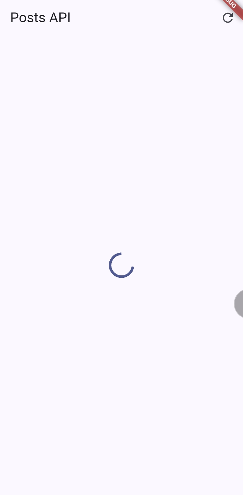
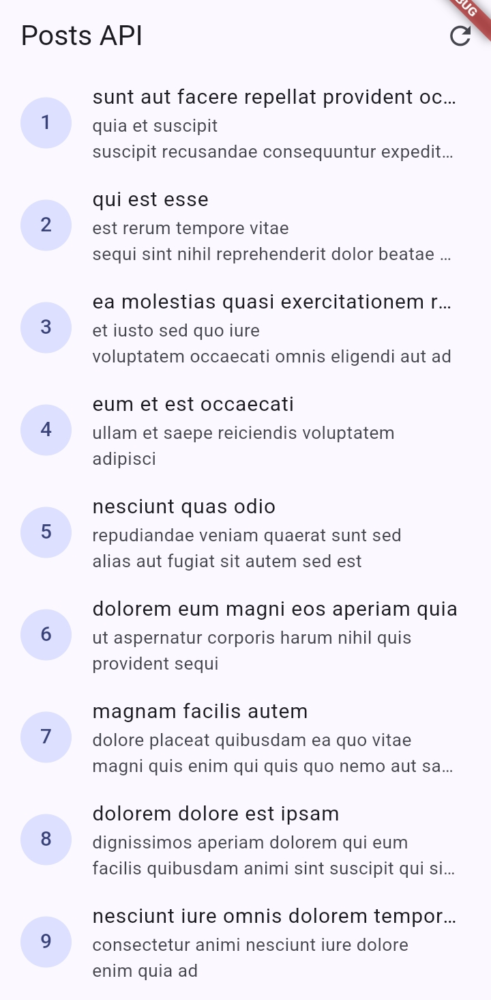
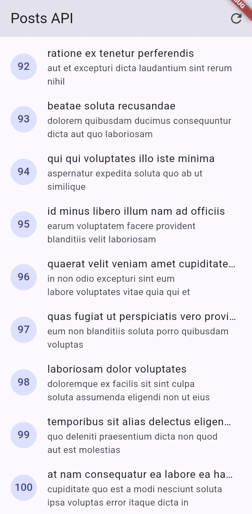
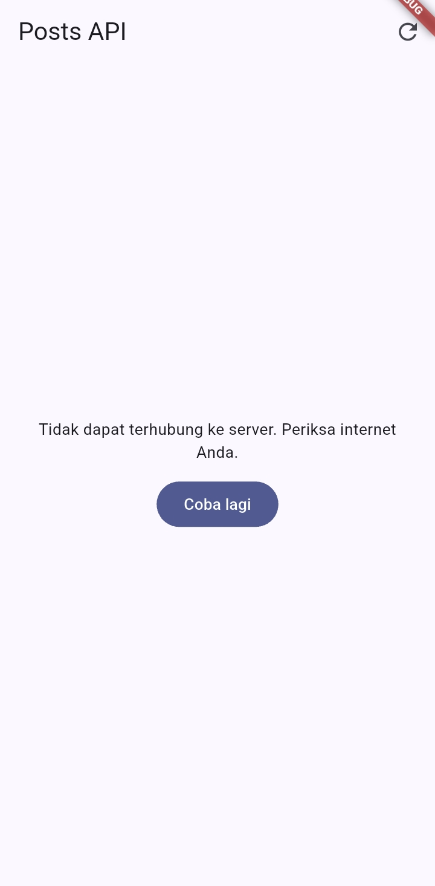
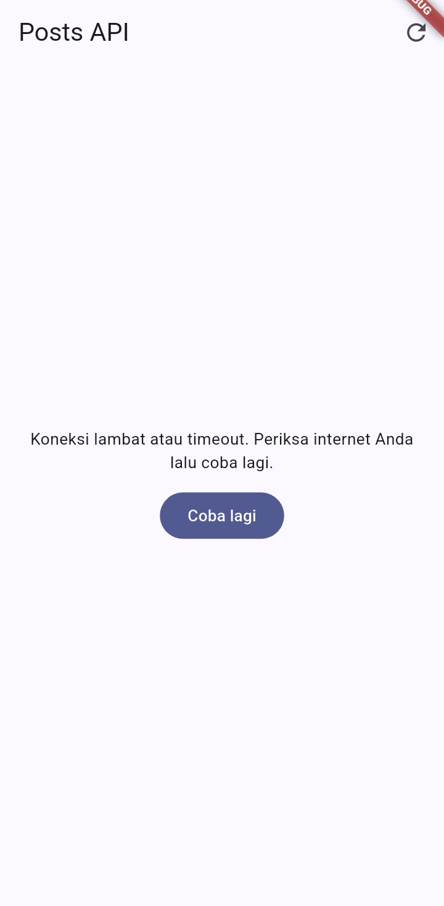
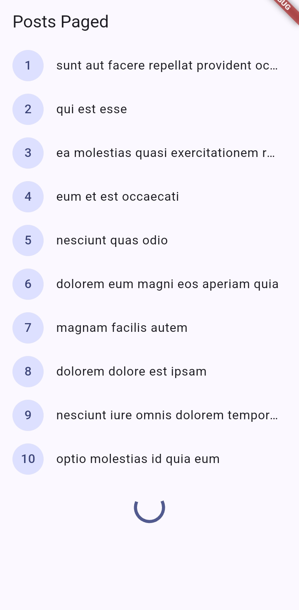
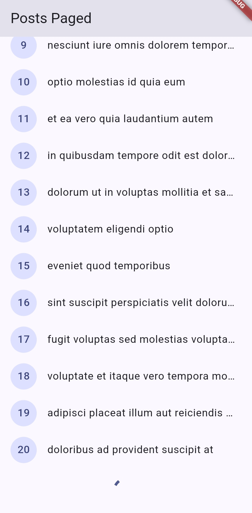
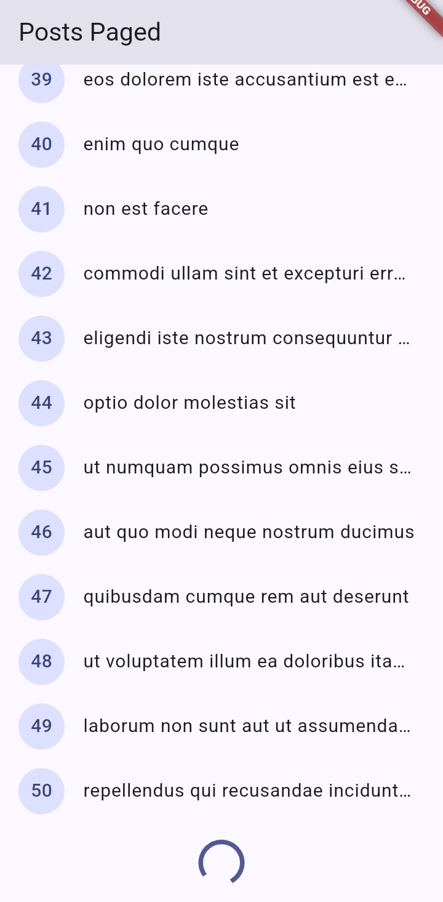
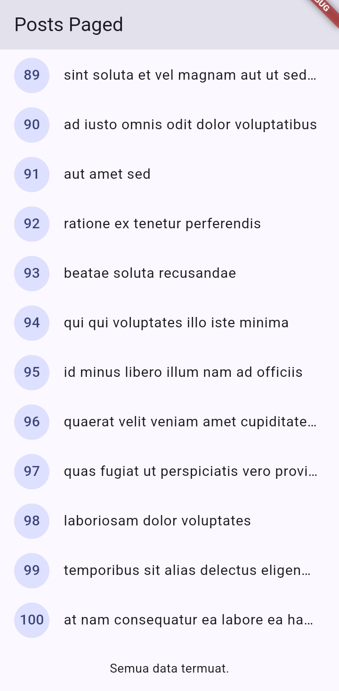

# LAPORAN PRAKTIKUM - WEEK 4 PEMROGRAMAN MOBILE

## Identitas Mahasiswa

| Keterangan | Detail |
|---|---|
| Nama | Mufliha Hafsyah Shahieza |
| NIM | 244107020147 |
| Kelas | TI-3G |

---

## JOBSHEET WEEK 4 Networking & REST API

---
### Praktikum 1:  Dio dan model data

Praktikum ini membangun fondasi layer data aplikasi: model `Post` untuk mem-parsing JSON dengan aman, konfigurasi Dio yang terpusat, dan repository sebagai satu-satunya jalur untuk mengakses REST API [JSONPlaceholder](https://jsonplaceholder.typicode.com).

#### Struktur & Konsep

- **`Post` model** (`lib/data/models/post.dart`): `fromJson` ditulis dengan cast defensif, seperti `as String? ?? ''` dan `(json['userId'] as num?)?.toInt() ?? 0`, supaya aplikasi tidak crash kalau ada field API yang hilang atau berubah tipe.
- **`createDio()`** (`lib/data/api_client.dart`): semua konfigurasi jaringan dikumpulkan di satu tempat, meliputi `baseUrl`, `connectTimeout`, `receiveTimeout` (masing-masing 10 detik), dan `LogInterceptor` untuk melihat log request/response saat debugging.
- **`PostRepository`** (`lib/data/repositories/post_repository.dart`): satu-satunya bagian kode yang memanggil Dio secara langsung. Method `fetchPosts()` sengaja tidak diberi `try/catch`, karena error yang terjadi dibiarkan naik ke pemanggilnya dan nanti ditangani otomatis oleh provider sebagai `AsyncError`.

---
### Praktikum 2: Provider dan error handling

#### Hasil Pengujian Tiga Skenario Error

**Skenario 1: Jalankan aplikasi dengan internet normal, amati loading lalu daftar 100 posts**

| Loading | Post 1-9 | Post 92-100 |
|---|---|---|
|  |  |  |

Loading tampil singkat sebelum data muncul, dan seluruh 100 post dari JSONPlaceholder berhasil dimuat dan ditampilkan dengan benar dari awal hingga akhir daftar.
  

**Skenario 2: Matikan internet (mode pesawat), tekan refresh, amati pesan ramah + tombol Coba lagi. Nyalakan kembali internet, tekan Coba lagi.**

| Error saat pffline | Setelah online kembali |
|---|---|
|  |  |

Saat tidak ada koneksi internet, pesan ramah "Tidak dapat terhubung ke server. Periksa internet Anda." muncul beserta tombol Coba lagi. Setelah internet dinyalakan kembali dan tombol Coba lagi ditekan, data berhasil dimuat ulang sepenuhnya.
  

**Skenario 3: Sementara ubah baseUrl menjadi URL salah, amati pesan error koneksi. Kembalikan setelah uji**

Pesan error koneksi muncul karena domain yang dituju tidak dapat dijangkau. Setelah `baseUrl` dikembalikan ke alamat yang benar, aplikasi kembali berjalan normal.

---
### Praktikum 3: Pagination dasar

#### Hasil Implementasi

| Halaman 1 | Saat loading halaman berikutnya |
|---|---|
|  |  |

| Halaman tengah | Halaman terakhir |
|---|---|
|  |  |

#### Analisis

Pengujian membuktikan bahwa data lama tetap ditampilkan selama proses pemuatan halaman berikutnya berlangsung (indikator loading muncul di bagian bawah list, bukan menggantikan seluruh tampilan), sesuai konsep infinite scroll yang diharapkan. Guard ganda pada `loadNextPage()` juga terbukti berhasil mencegah request berlebihan meskipun listener scroll berpotensi terpanggil berkali-kali dalam waktu singkat saat pengguna scroll dengan cepat. Setelah seluruh 100 data berhasil dimuat, `hasMore` bernilai `false` dan aplikasi menampilkan teks "Semua data termuat." tanpa melakukan request tambahan yang tidak perlu.

---
