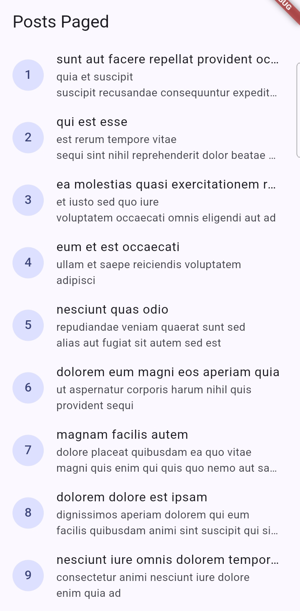
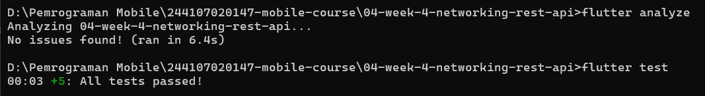
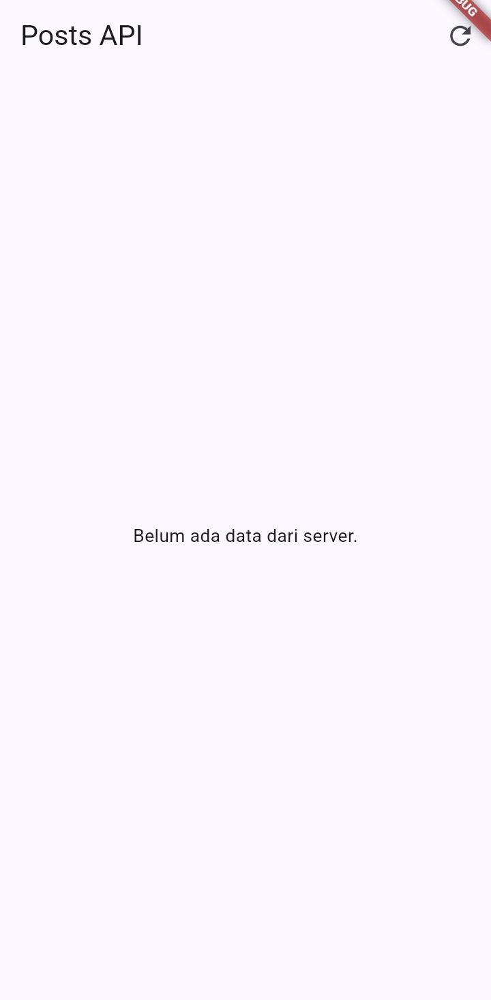
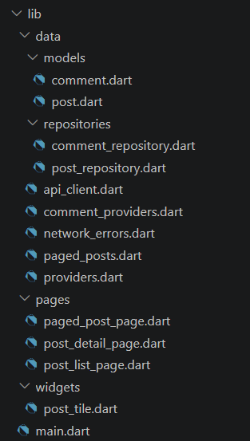

# LAPORAN PRAKTIKUM - WEEK 4 PEMROGRAMAN MOBILE

## Identitas Mahasiswa

| Keterangan | Detail |
|---|---|
| Nama | Mufliha Hafsyah Shahieza |
| NIM | 244107020147 |
| Kelas | TI-3G |

---

## JOBSHEET WEEK 4 Networking & REST API

---
### Praktikum 1:  Dio dan model data

Praktikum ini membangun fondasi layer data aplikasi: model `Post` untuk mem-parsing JSON dengan aman, konfigurasi Dio yang terpusat, dan repository sebagai satu-satunya jalur untuk mengakses REST API [JSONPlaceholder](https://jsonplaceholder.typicode.com).

#### Struktur & Konsep

- **`Post` model** (`lib/data/models/post.dart`): `fromJson` ditulis dengan cast defensif, seperti `as String? ?? ''` dan `(json['userId'] as num?)?.toInt() ?? 0`, supaya aplikasi tidak crash kalau ada field API yang hilang atau berubah tipe.
- **`createDio()`** (`lib/data/api_client.dart`): semua konfigurasi jaringan dikumpulkan di satu tempat, meliputi `baseUrl`, `connectTimeout`, `receiveTimeout` (masing-masing 10 detik), dan `LogInterceptor` untuk melihat log request/response saat debugging.
- **`PostRepository`** (`lib/data/repositories/post_repository.dart`): satu-satunya bagian kode yang memanggil Dio secara langsung. Method `fetchPosts()` sengaja tidak diberi `try/catch`, karena error yang terjadi dibiarkan naik ke pemanggilnya dan nanti ditangani otomatis oleh provider sebagai `AsyncError`.

---
### Praktikum 2: Provider dan error handling

#### Hasil Pengujian Tiga Skenario Error

**Skenario 1: Jalankan aplikasi dengan internet normal, amati loading lalu daftar 100 posts**

| Loading | Post 1-9 | Post 92-100 |
|---|---|---|
|  |  |  |

Loading tampil singkat sebelum data muncul, dan seluruh 100 post dari JSONPlaceholder berhasil dimuat dan ditampilkan dengan benar dari awal hingga akhir daftar.
<br><br>

**Skenario 2: Matikan internet (mode pesawat), tekan refresh, amati pesan ramah + tombol Coba lagi. Nyalakan kembali internet, tekan Coba lagi.**

| Error saat pffline | Setelah online kembali |
|---|---|
|  |  |

Saat tidak ada koneksi internet, pesan ramah "Tidak dapat terhubung ke server. Periksa internet Anda." muncul beserta tombol Coba lagi. Setelah internet dinyalakan kembali dan tombol Coba lagi ditekan, data berhasil dimuat ulang sepenuhnya.
<br><br>

**Skenario 3: Sementara ubah baseUrl menjadi URL salah, amati pesan error koneksi. Kembalikan setelah uji**


Pesan error koneksi muncul karena domain yang dituju tidak dapat dijangkau. Setelah `baseUrl` dikembalikan ke alamat yang benar, aplikasi kembali berjalan normal.

---
### Praktikum 3: Pagination dasar

#### Hasil Implementasi

| Halaman 1 | Saat loading halaman berikutnya |
|---|---|
|  |  |

| Halaman tengah | Halaman terakhir |
|---|---|
|  |  |

#### Analisis

Pengujian membuktikan bahwa data lama tetap ditampilkan selama proses pemuatan halaman berikutnya berlangsung (indikator loading muncul di bagian bawah list, bukan menggantikan seluruh tampilan), sesuai konsep infinite scroll yang diharapkan. Guard ganda pada `loadNextPage()` juga terbukti berhasil mencegah request berlebihan meskipun listener scroll berpotensi terpanggil berkali-kali dalam waktu singkat saat pengguna scroll dengan cepat. Setelah seluruh 100 data berhasil dimuat, `hasMore` bernilai `false` dan aplikasi menampilkan teks "Semua data termuat." tanpa melakukan request tambahan yang tidak perlu.

---

### AI Prompt Challenge

Dokumentasi lengkap proses AI Prompt Challenge (prompt yang digunakan, output awal AI, temuan masalah, dan proses perbaikan) dapat dilihat di:

[docs/ai-verification.md](docs/ai-verification.md)

---

### Refactoring Challenge

Tiga penyesuaian dilakukan untuk merapikan struktur kode dan menambah fitur navigasi:

1. **Ekstrak `PostTile`** (`lib/widgets/post_tile.dart`): baris tampilan post yang sebelumnya ditulis langsung di dalam `ListView.builder` diekstrak menjadi widget tersendiri, menerima `post` dan `onTap` opsional. Widget ini dipakai ulang di `PagedPostPage`.
2. **Pindahkan `friendlyErrorMessage`** ke `lib/data/network_errors.dart`, agar dapat dipakai bersama oleh halaman post biasa (`PostListPage`), halaman paginated (`PagedPostPage`), maupun halaman detail (`PostDetailPage`), tanpa duplikasi logic penerjemahan error.
3. **Tambah halaman detail dengan GoRouter** (`lib/pages/post_detail_page.dart`, route `/post/:id`): menampilkan `title` dan `body` lengkap dari post yang dipilih. Data diambil dari `postListProvider` yang sudah dimuat sebelumnya, sehingga tidak perlu request tambahan saat berpindah dari list ke detail.

#### Hasil Implementasi

| List dengan PostTile | Halaman detail |
|---|---|
|  |  |

#### Analisis

Karena `PostDetailPage` mengambil data dari `postListProvider` yang sudah ter-cache, navigasi dari list ke detail berlangsung instan tanpa loading tambahan. Namun, hal ini menimbulkan konsekuensi pada skenario deep-link: jika halaman detail dibuka langsung melalui URL (misalnya `/post/5`) tanpa pernah membuka halaman list terlebih dahulu, `postListProvider` akan otomatis memuat seluruh 100 post terlebih dahulu sebelum menemukan post yang dicari. Pendekatan ini dipilih karena sesuai dengan alur penggunaan aplikasi saat ini (pengguna selalu mengakses detail melalui list), namun bila aplikasi perlu mendukung deep-link langsung ke detail secara efisien, pendekatan yang lebih tepat adalah memanggil repository secara langsung berdasarkan `id` tanpa bergantung pada list yang sudah dimuat.

---

### Testing

Empat unit test dibuat di `test/post_test.dart` untuk menguji parsing model, mapping error, dan provider menggunakan repository palsu (tanpa koneksi internet asli):

1. **`fromJson` aman terhadap field yang hilang** memverifikasi bahwa `Post.fromJson({'id': 7})` tidak crash meski hanya field `id` yang tersedia, dan field lain (`title`, `userId`) jatuh ke nilai default.
2. **`friendlyErrorMessage` untuk connection error** memverifikasi bahwa `DioExceptionType.connectionError` diterjemahkan ke pesan yang mengandung kata "terhubung".
3. **Provider sukses dengan repository palsu** menggunakan `FakePostRepository` yang mengembalikan data statis, memverifikasi `postListProvider` menghasilkan data yang sesuai tanpa melakukan request HTTP sungguhan.
4. **Provider error dengan repository palsu** `FakePostRepository` dikonfigurasi untuk selalu melempar `DioException`, memverifikasi `postListProvider` menghasilkan `AsyncError` yang benar dan pesan ramahnya sesuai.


**Hasil:**<br>
<br>

---

### Checklist Verifikasi Mandiri

**1. UI tidak memanggil Dio langsung, semua akses data lewat repository + provider.**<br> 
| Post 1-9 | Post 92-100 |
|---|---|
|  |  |
seluruh akses data melalui `PostRepository` dan provider (`postListProvider`, `pagedPostsProvider`).<br>

**2. Empat state tampil benar: loading, error (+ retry), empty, success.**<br>
| Loading | Error (+ retry)| Empty| Success |
|---|---|---|---|
|  |  |  |  |

**3. Pagination: data bertambah saat scroll, tidak ada request ganda, ada indikator akhir data.**<br>
| Halaman Awal | Halaman Tengah | Halaman Akhir |
|---|---|---|
| |  |  |

**4. `flutter analyze` tanpa issue dan semua test lulus.**<br>
<br>

**5. Hasil AI diverifikasi dan didokumentasikan pada folder docs/.**<br> 
Hasil AI Prompt Challenge diverifikasi menggunakan AI Verification Checklist dan didokumentasikan lengkap pada [`docs/ai-verification.md`](docs/ai-verification.md).

---

### Mini Project: Aplikasi Daftar Data dari REST API

Seluruh requirement mini project sudah terpenuhi melalui pengerjaan praktikum dan tantangan di atas:

**1. Ambil data dari API dummy:**<br> 
Data diambil dari JSONPlaceholder (`/posts`) melalui `PostRepository`, ditampilkan ke UI melalui `postListProvider` dan `pagedPostsProvider` (Riverpod).<br>

<br>

**2. Dio terpusat:**<br> 
Konfigurasi `baseUrl`, timeout, dan `LogInterceptor` didefinisikan satu kali di `createDio()` (`lib/data/api_client.dart`), dipakai bersama oleh seluruh repository. Model `Post` dan `Comment` menggunakan `fromJson` yang aman terhadap null.
<br>

**3. Empat state UI**:<br> 
Loading, error (dengan tombol retry), empty, dan success ditangani dan diuji pada Praktikum 2.

| Loading | Error (+ retry)| Empty| Success |
|---|---|---|---|
|  |  |  |  |
<br>

**4. Pagination dengan infinite scroll:**<br>
10 item per halaman, guard ganda mencegah request bersamaan, indikator loading dan "Semua data termuat." ditampilkan sesuai kondisi.

   | Halaman 1 | Halaman terakhir |
   |---|---|
   |  |  |
<br>

**5. Minimal 2 test yang lulus:**<br> 
Empat unit test tersedia di `test/post_test.dart` : parsing model aman null, mapping error, serta dua test provider menggunakan `FakePostRepository` (sukses dan gagal), tanpa melakukan request HTTP sungguhan.<br>

<br>

**6. AI Prompt Challenge terdokumentasi:**<br> Prompt, output awal AI, tiga masalah yang ditemukan, proses perbaikan, dan hasil akhir didokumentasikan lengkap di [`docs/ai-verification.md`](docs/ai-verification.md).
<br>

**7. Struktur folder sesuai portofolio:**<br>
Project ditempatkan di `04-week-4-networking-rest-api/` dengan struktur `lib/`, `test/`, `docs/`, `screenshots/`, dan `README.md` ini.<br>



#### Cara Menjalankan

```bash
cd 04-week-4-networking-rest-api
flutter pub get
flutter run
```

---

## Refleksi

1. **Mengapa UI dilarang memanggil Dio langsung? Apa yang rusak jika aturan ini dilanggar?**<br>
Jawaban:<br>
UI dilarang memanggil Dio secara langsung karena akan membuat widget bertanggung jawab atas terlalu banyak hal sekaligus diantaranya menampilkan tampilan, mengatur state, sekaligus menangani detail teknis jaringan seperti timeout dan error handling. Jika aturan ini dilanggar, kode jaringan akan tersebar di banyak widget yang berbeda, sehingga sulit diuji (karena widget test biasanya tidak seharusnya melakukan request HTTP sungguhan), sulit diganti sumber datanya (misalnya saat ingin memakai repository palsu untuk testing seperti pada `FakePostRepository`), dan setiap perubahan pada logic jaringan (misalnya menambah header baru) harus dilakukan berulang kali di banyak tempat, bukan cukup di satu file `api_client.dart` saja. Repository pattern memisahkan urusan ini, sehingga UI cukup fokus membaca `AsyncValue` dari provider tanpa perlu tahu detail bagaimana data itu diambil.<br>

2. **Kapan pagination client-side cukup, dan kapan harus mengandalkan pagination server (`_page`/`_limit`)?**<br>
Jawaban:<br>
Pagination client-side cukup digunakan ketika jumlah data keseluruhan relatif kecil, sehingga tidak membebani jaringan maupun memori perangkat secara berarti. Namun, untuk data dalam jumlah besar seperti 100 post pada JSONPlaceholder, pagination server (menggunakan parameter `_page` dan `_limit`) jauh lebih tepat, karena hanya data yang benar-benar dibutuhkan saat itu yang diminta ke server. Hal ini mengurangi waktu tunggu di awal, menghemat kuota data pengguna, dan tetap membuat aplikasi responsif meskipun total data di server terus bertambah seiring waktu.<br>

3. **Bagaimana exception repository berubah menjadi `AsyncError` tanpa try/catch di setiap widget? Kapan try/catch eksplisit tetap dibutuhkan?**<br>
Jawaban:<br>
- Ketika method `build()` pada `AsyncNotifier` (seperti `PostListNotifier`) memanggil repository dan repository tersebut melempar exception, Riverpod secara otomatis menangkap exception itu dan mengemasnya menjadi `AsyncError`, tanpa perlu penulisan `try/catch` secara eksplisit. Inilah yang dimaksud pada modul sebagai "ekuivalen deklaratif dari `AsyncValue.guard`". Widget yang membaca provider tersebut lewat `.when()` otomatis mendapat cabang `error` tanpa harus menangani exception secara manual.
- Namun, `try/catch` eksplisit tetap dibutuhkan pada method yang dipanggil di luar siklus `build()`, seperti method `refresh()` pada `PostListNotifier`. Karena `refresh()` dipicu secara manual oleh pengguna (menekan tombol refresh), bukan oleh mekanisme internal Riverpod saat inisialisasi provider, exception yang terjadi di dalamnya tidak akan otomatis dikonversi menjadi `AsyncError` kecuali ditangkap secara manual dan di-assign ke `state` menggunakan `try/catch`.<br>

4. **Bagian mana dari hasil AI yang Anda perbaiki, dan mengapa?**<br>
Jawaban:<br>
Pada AI Prompt Challenge, kode awal yang dihasilkan AI untuk repository layer `Comments` ternyata gagal sejak tahap `flutter analyze`, dan perlu tiga kali iterasi perbaikan sebelum benar-benar berhasil. Pertama, deklarasi provider dengan generic type yang dipecah menjadi dua baris menyebabkan 37 error sekaligus akibat kesalahan sintaks, sehingga diperbaiki dengan menuliskannya kembali dalam satu baris utuh.<br>
Kedua, AI menggunakan kelas `FamilyAsyncNotifier` yang ternyata tidak kompatibel dengan versi `flutter_riverpod` yang digunakan pada proyek ini, sehingga pendekatan diganti sepenuhnya menjadi `FutureProvider.family` yang lebih sederhana dan tetap memenuhi kebutuhan penanganan error otomatis. <br>
Ketiga, file `test/widget_test.dart` bawaan Flutter yang masih berisi pengujian counter default menyebabkan kegagalan test, sehingga perlu dikosongkan dan diberi fungsi `main()` kosong sebagai penanda. Pengalaman ini menunjukkan bahwa kode hasil AI, meskipun secara konsep sudah sesuai dengan permintaan, tetap wajib diverifikasi secara teknis melalui `flutter analyze` dan `flutter test`, karena kesalahan bisa muncul dari hal-hal teknis seperti kompatibilitas versi package dan format penulisan kode, bukan hanya dari kesalahan logika.<br>

---