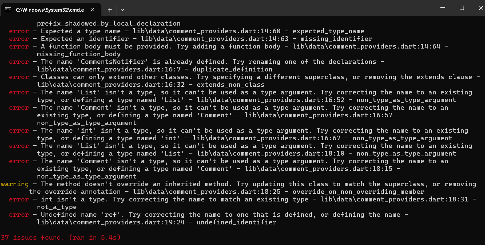
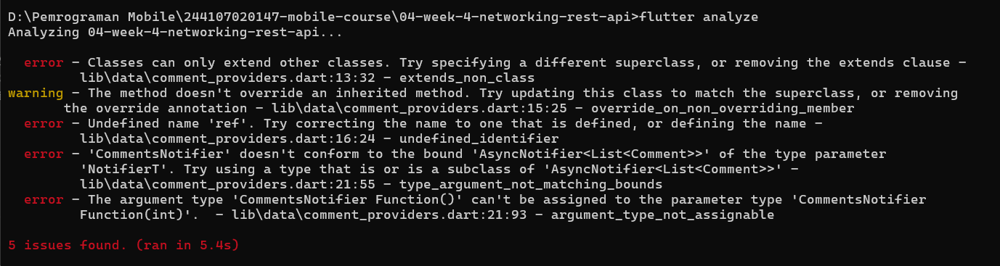
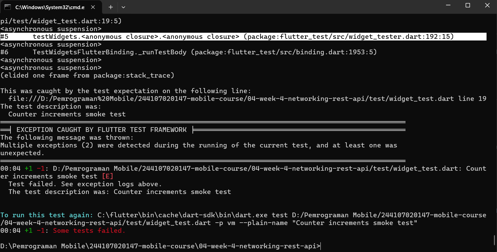
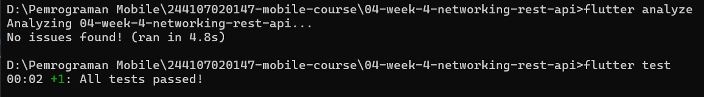

## AI Challenge

### AI Prompt Challenge
**Prompt yang Digunakan:**

```
Buatkan repository layer Flutter untuk endpoint GET /comments?postId={id}
dari JSONPlaceholder menggunakan Dio + flutter_riverpod.
Requirements:
- Model Comment dengan fromJson aman null (postId, id, name, email, body).
- CommentRepository dengan method fetchComments(postId) + timeout 10 detik.
- AsyncNotifierProvider dengan penanganan error otomatis (AsyncError)
  dan fungsi pesan error ramah pengguna untuk timeout, connection error,
  404, dan 500.
- Satu unit test untuk fromJson dengan field yang hilang.
Jelaskan setiap bagian kode dalam komentar.
```

AI yang digunakan: Claude (chat assistant), sesuai kebijakan AI pada modul minggu ini yang memperbolehkan AI membantu merancang repository layer dengan syarat wajib diverifikasi.

---
### Output Awal AI

AI menghasilkan 4 file: 
1. `models/comment.dart` 
2. `repositories/comment_repository.dart`
3. `comment_providers.dart` (menggunakan `FamilyAsyncNotifier`)
4. `test/comment_test.dart`.

---
### Verifikasi menggunakan AI Verification Checklist

| Poin Checklist | Hasil Verifikasi |
|---|---|
| Apakah UI memanggil Dio secara langsung (dilarang) atau lewat repository? |  Lewat repository `CommentRepository` satu-satunya kelas yang memanggil `_dio`. |
| Apakah `fromJson` aman null, atau masih memakai cast langsung yang bisa crash?| Sebagian, karena field `body` pada `Comment.fromJson` awalnya menggunakan cast langsung (`json['body'] as String`) tanpa fallback, berpotensi crash jika field hilang. Diperbaiki menjadi `as String? ?? ''`. |
| Apakah semua tipe `DioExceptionType` (timeout, connectionError, badResponse) dipetakan ke pesan pengguna? | Ya timeout, connectionError, dan badResponse (404, selain itu generik) sudah ditangani pada `commentErrorMessage()`. |
| Apakah `baseUrl`/timeout terpusat di satu client, bukan tersebar di tiap method? | Ya tetap menggunakan `createDio()` yang sama dari `api_client.dart`. |
| Apakah test AI benar-benar menguji kasus field hilang, atau hanya happy path? Tambahkan minimal 1 edge case sendiri. | Hanya happy path, test awal hanya menguji JSON lengkap. Ditambahkan 1 edge case sendiri untuk field yang hilang. |
| Jalankan `flutter analyze` dan `flutter test`, apakah hasil AI lolos tanpa warning? | Tidak lolos di awal, ditemukan 3 masalah signifikan (dijelaskan di bawah). |

---
### Masalah yang Ditemukan dan Perbaikan

#### Masalah 1: Error sintaks akibat deklarasi generic type yang terpotong baris

<br><br>

Kode awal menuliskan deklarasi provider dengan generic type yang dipecah menjadi dua baris:
```dart
final commentsProvider = AsyncNotifierProvider.family
    CommentsNotifier, List<Comment>, int>(CommentsNotifier.new);
```
Pemecahan baris ini menyebabkan 37 error sekaligus saat `flutter analyze` dijalankan, karena parser Dart tidak dapat mengenali kelanjutan deklarasi generic type dengan benar.<br>

**Perbaikan:** Menuliskan ulang deklarasi provider dalam satu baris utuh tanpa dipecah.

---
#### Masalah 2: `FamilyAsyncNotifier` tidak kompatibel dengan versi Riverpod yang terinstal

<br><br>

Setelah masalah sintaks diperbaiki, muncul error baru: `Classes can only extend other classes`, menandakan `FamilyAsyncNotifier` tidak dikenali sebagai kelas yang valid pada versi `flutter_riverpod` yang digunakan di proyek ini.<br>

**Perbaikan:** Mengganti pendekatan sepenuhnya dari pola `AsyncNotifierProvider.family` dengan kelas notifier kustom, menjadi `FutureProvider.family<List<Comment>, int>` yang lebih sederhana. Karena data komentar hanya dibaca sekali tanpa aksi refresh manual dari pengguna, `FutureProvider.family` sudah cukup untuk menghasilkan `AsyncValue` (loading/error/data) secara otomatis tanpa memerlukan kelas Notifier kustom.

---
#### Masalah 3: Test bawaan Flutter (`widget_test.dart`) tidak relevan dan tanpa `main()`

<br><br>

`test/widget_test.dart` bawaan `flutter create` masih berisi pengujian counter app default yang tidak relevan dengan aplikasi ini, menyebabkan kegagalan test. Setelah dikosongkan menjadi komentar saja, muncul error baru karena Dart mensyaratkan keberadaan fungsi `main()` pada setiap file test agar dapat dimuat.<br>

**Perbaikan:** Mengisi `test/widget_test.dart` dengan `main()` kosong disertai komentar penjelasan, sebagai penanda bahwa unit test sesungguhnya diletakkan pada file terpisah (`comment_test.dart`, `post_test.dart`).

---
### Edge Case Tambahan yang Ditambahkan Sendiri

Selain memperbaiki `fromJson` agar aman terhadap field `body` yang hilang, ditambahkan pula unit test edge case berikut untuk melengkapi pengujian AI yang awalnya hanya mencakup happy path:

```dart
test('fromJson aman terhadap field yang hilang', () {
  final comment = Comment.fromJson({'id': 5});
  expect(comment.id, 5);
  expect(comment.name, '');
  expect(comment.body, '');
});
```
---
### Hasil Akhir



---
### Kesimpulan

Berbeda dari pengalaman AI Prompt Challenge pada minggu sebelumnya yang kodenya secara struktural sudah benar namun bermasalah pada pengujian, kode AI pada tantangan minggu ini justru gagal sejak tahap kompilasi (`flutter analyze`). Ditemukan tiga masalah berbeda: kesalahan sintaks akibat pemisahan baris pada deklarasi generic, penggunaan kelas API (`FamilyAsyncNotifier`) yang tidak kompatibel dengan versi package yang digunakan, serta konflik dengan file test bawaan Flutter. Pengalaman ini menegaskan bahwa kode hasil AI tidak boleh diasumsikan langsung dapat dikompilasi maupun dijalankan, sekalipun secara konsep sudah sesuai dengan requirement yang diberikan. Verifikasi menyeluruh terhadap `flutter analyze` dan `flutter test`, bukan hanya pembacaan kode secara sekilas, tetap menjadi langkah wajib sebelum kode AI diterima.
---