# LAPORAN PRAKTIKUM - WEEK 5 PEMROGRAMAN MOBILE

## Identitas Mahasiswa

| Keterangan | Detail |
|---|---|
| Nama | Mufliha Hafsyah Shahieza |
| NIM | 244107020147 |
| Kelas | TI-3G |

---

## JOBSHEET WEEK 5 Local Storage & Offline First

---
### Praktikum 1: SharedPreferences

Praktikum ini membangun repository untuk menyimpan preferensi sederhana (mode gelap/terang dan waktu terakhir dibuka aplikasi) menggunakan SharedPreferences, dihubungkan ke Riverpod melalui `AsyncNotifierProvider`.

#### Analisis

Seluruh akses `SharedPreferences.getInstance()` dipusatkan pada `PrefsRepository`, bukan dipanggil langsung dari widget. Hal ini menghindari kesalahan umum yang disebutkan pada modul, yaitu memanggil `SharedPreferences.getInstance()` langsung di dalam `build()` widget, yang akan membuat hasilnya sulit di-cache dan diuji. Pola ini konsisten dengan repository pattern yang telah dipelajari pada Minggu 4, hanya saja sumber datanya berbeda (penyimpanan lokal, bukan REST API).

---
### Praktikum 2: SQLite dan repository catatan


#### Hasil Implementasi

| Kondisi Kosong | Dialog Tambah Catatan | Setelah Tambah Catatan | Setelah Hapus |
|---|---|---|---|
| 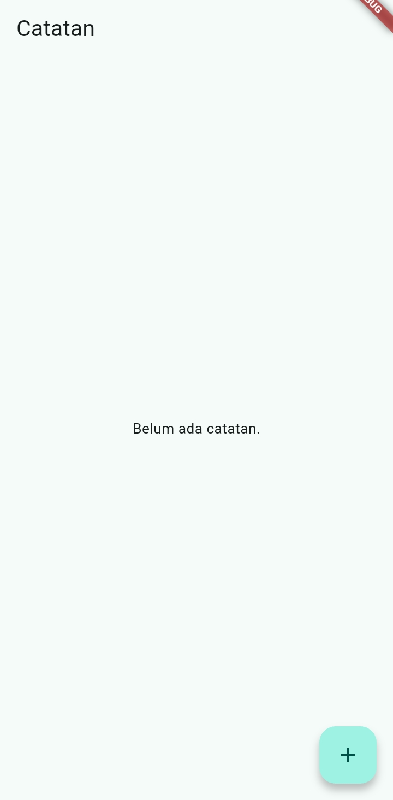 | 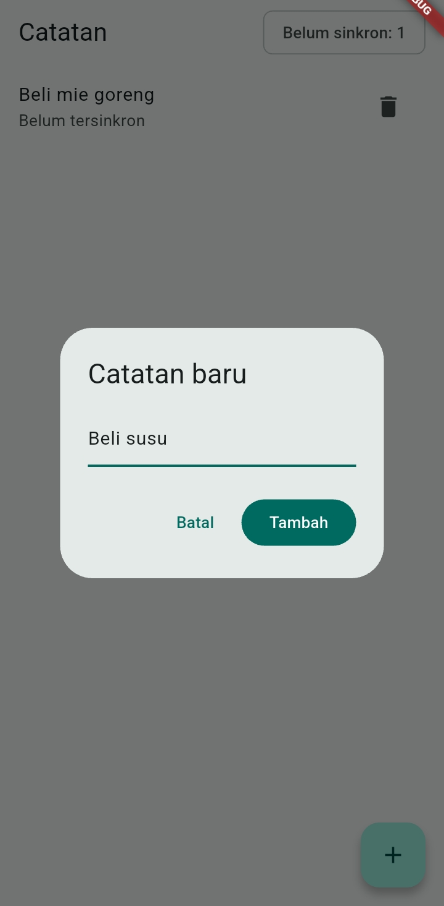 | 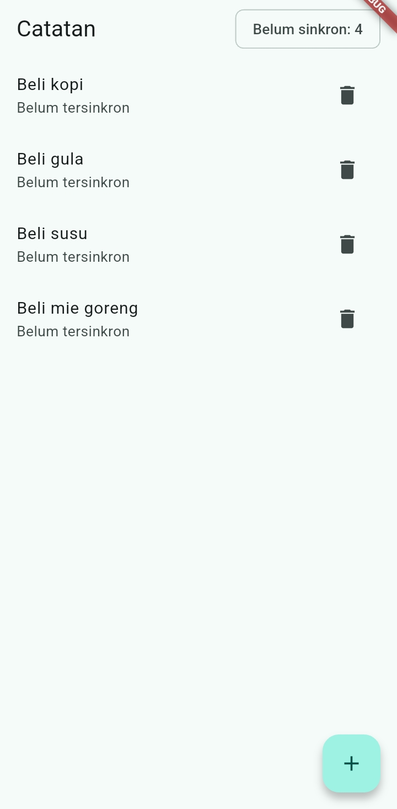 | 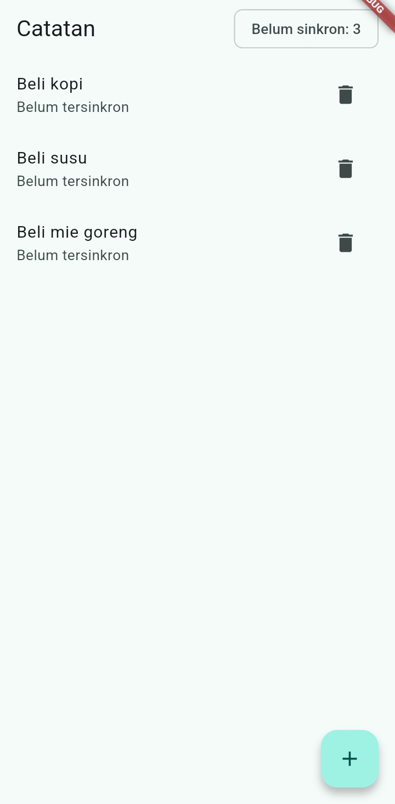 |

#### Analisis

Badge "Belum sinkron: X" pada `AppBar` terbukti akurat mengikuti jumlah catatan dengan `dirty = true`, bertambah saat catatan baru ditambahkan (karena `addNote` selalu membuat catatan dengan `dirty: true`) dan berkurang saat catatan dihapus. 

---
### Praktikum 3: Cache-first dan antrean sync

#### Hasil Implementasi

| Cache Posts Tetap Muncul Saat Offline | Sebelum Sync | Setelah Sync Berhasil |
|---|---|---|
| 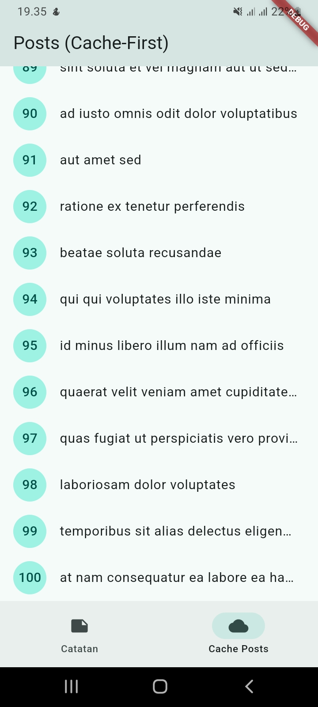 | 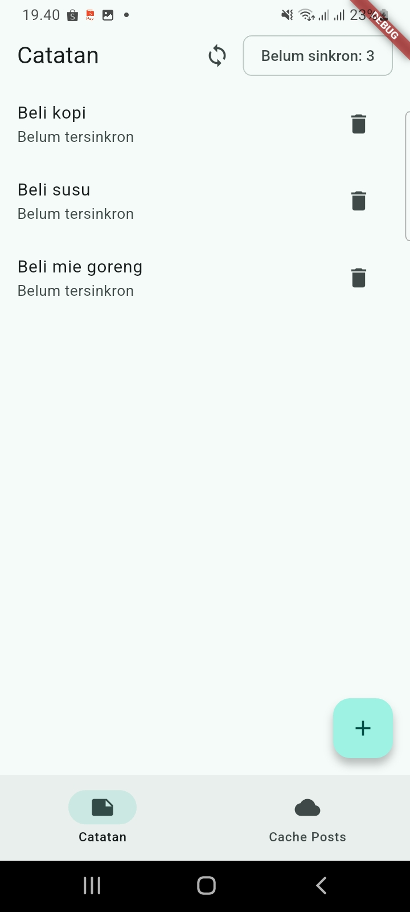 | 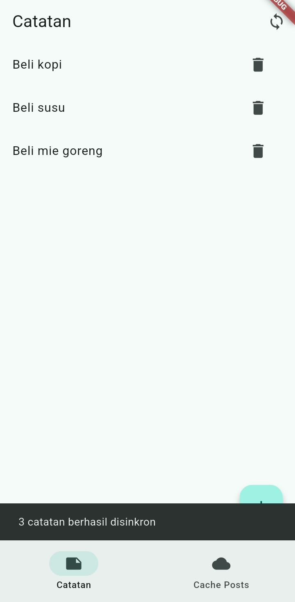 |

#### Analisis

- Pengujian mode offline membuktikan bahwa data cache tetap dapat diakses sepenuhnya tanpa koneksi internet, karena `cachedPostsProvider` membaca dari tabel `cached_posts` di SQLite, bukan langsung dari jaringan. Kegagalan `_refreshInBackground()` saat offline ditangani secara diam-diam (`catch (_) {}`) agar tidak mengganggu data cache yang sudah valid ditampilkan ke pengguna.
- Tombol sinkronisasi pada `NotesPage` memanggil `syncNotes()` yang membaca `countDirty()` terlebih dahulu, lalu menandai seluruh catatan sebagai bersih (`dirty = 0`) setelah simulasi pengiriman ke server berhasil. Invalidasi pada `notesProvider` dan `dirtyCountProvider` setelah sinkronisasi memastikan badge dan label "Belum tersinkron" pada tiap catatan langsung diperbarui tanpa perlu me-restart aplikasi.

---
### AI Prompt Challenge

Dokumentasi lengkap proses AI Prompt Challenge (prompt yang digunakan, output awal AI, temuan masalah, dan proses perbaikan) dapat dilihat di:

[docs/ai-verification.md](docs/ai-verification.md)

---
### Refactoring Challenge

Tiga penyesuaian dilakukan untuk merapikan struktur kode dan menambah fitur navigasi:

1. **Ekstrak `NoteTile`** (`lib/pages/widgets/note_tile.dart`): baris tampilan catatan yang sebelumnya ditulis langsung di dalam `ListView.builder` diekstrak menjadi widget tersendiri, menerima `note`, `onDelete`, dan `onTap` opsional. Widget ini menampilkan badge "Belum tersinkron" saat `dirty == true`.
2. **Pindahkan logic sync** ke `lib/data/sync.dart`: fungsi `loadPostsCacheFirst`, `refreshPostsInBackground`, dan `syncNotes` dipisah dari `NoteRepository`, sehingga repository tetap fokus pada operasi CRUD murni terhadap SQLite.
3. **Tambah halaman detail dengan GoRouter** (`lib/pages/note_detail_page.dart`, route `/note/:id`): menampilkan `title`, `body`, dan status sinkronisasi dari catatan yang dipilih. Data diambil langsung dari `notesProvider` berdasarkan `id` di URL, bukan dioper dari state halaman list.

#### Hasil Implementasi

| List dengan NoteTile | Halaman detail |
|---|---|
| 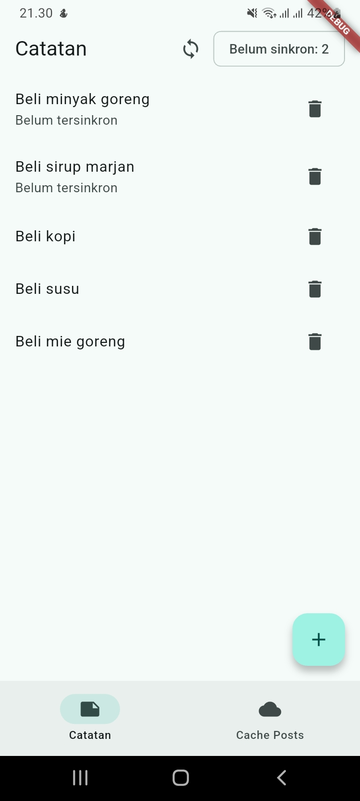 | 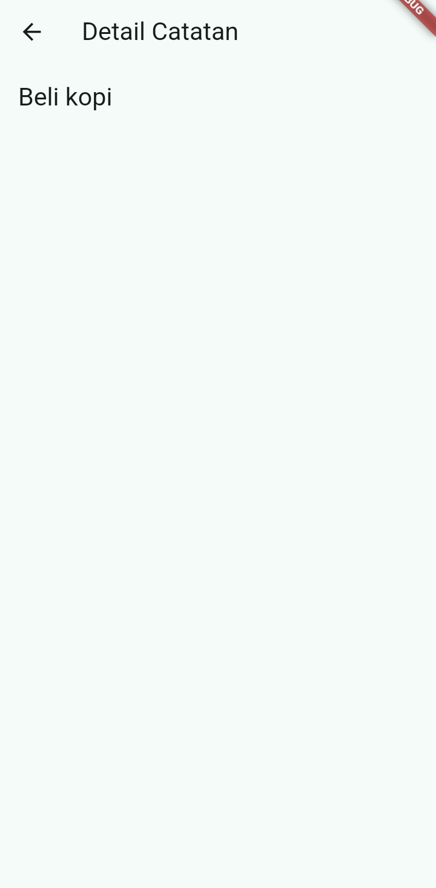 |

#### Analisis

Karena `NoteDetailPage` membaca ulang data dari `notesProvider` berdasarkan `id`, bukan menerima objek `Note` yang dioper langsung dari halaman list, halaman ini tetap bisa menampilkan data yang benar meski diakses lewat deep-link (`/note/:id` langsung) selama `notesProvider` sudah pernah dimuat sebelumnya. Pemisahan logic sync ke `lib/data/sync.dart` juga membuat `NoteRepository` lebih mudah diuji secara terisolasi, karena repository tidak lagi bertanggung jawab atas kapan dan bagaimana sinkronisasi dijalankan — itu murni urusan pemanggil (`NotesPage`).

---

### Testing

Tiga unit test dibuat di `test/note_test.dart` untuk menguji model `Note` dan provider `notesProvider`:

1. **`fromMap` aman terhadap field yang hilang** memverifikasi bahwa `Note.fromMap({'title': 'Belanja'})` tidak crash meski hanya field `title` yang tersedia, dan field lain (`body`, `dirty`) jatuh ke nilai default.
2. **Flag `dirty` bertahan pada serialisasi** memverifikasi bahwa nilai `dirty: true` pada sebuah `Note` tetap `true` setelah melalui proses `toMap()` lalu `fromMap()`, membuktikan konversi ke/dari SQLite tidak menghilangkan status sinkronisasi.
3. **Provider sukses dengan repository palsu** menggunakan `FakeNoteRepository` yang mengembalikan data statis, memverifikasi `notesProvider` menghasilkan data yang sesuai tanpa mengakses SQLite sungguhan.

**Hasil:**<br>
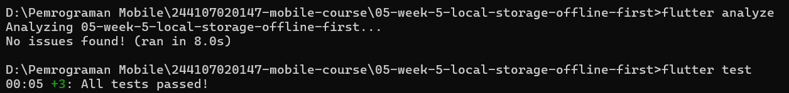 


---

### Checklist Verifikasi Mandiri

**1. UI tidak memanggil SQLite/SharedPreferences langsung; semua lewat repository + provider.**<br>
Seluruh akses data melalui `NoteRepository`, `PrefsRepository`, dan provider (`notesProvider`, `darkModeProvider`, `dirtyCountProvider`).

**2. Aplikasi penuh berfungsi dalam mode pesawat: baca, tambah, hapus catatan.**<br>

| Sebelum offline | App ditutup & dibuka ulang saat pesawat | Tambah catatan saat offline | Setelah ditambah saat offline | Hapus catatan saat offline |
|---|---|---|---|---|
|  | 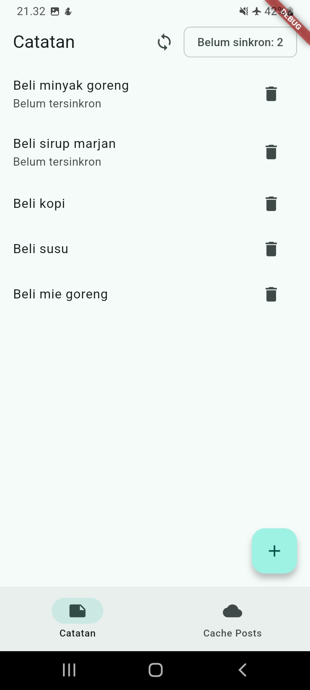 | 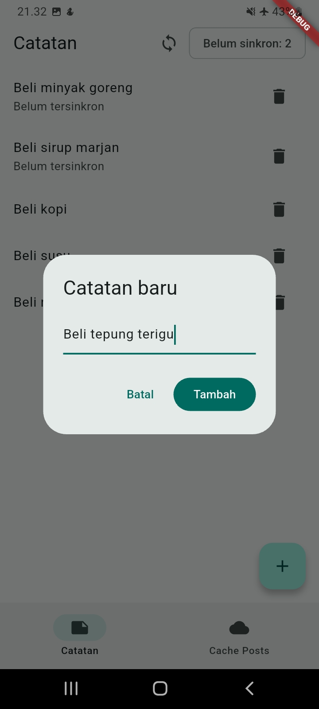 | 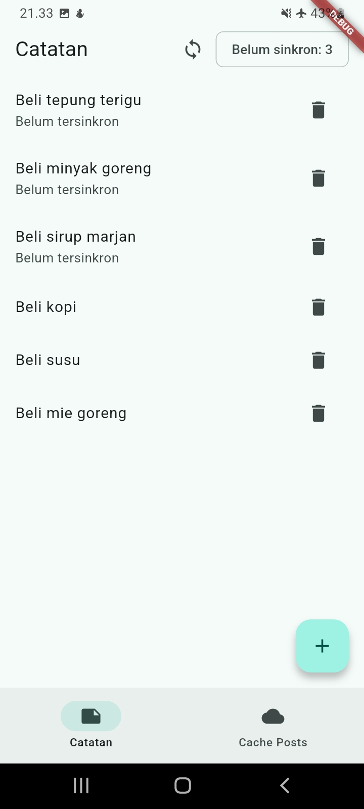 | 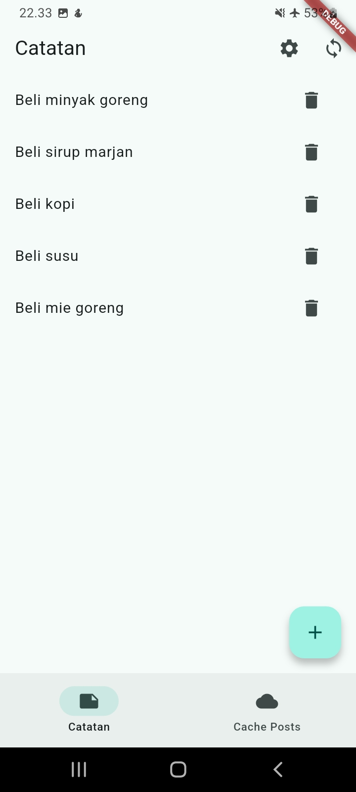 |


Catatan tetap tampil utuh dan tetap bisa ditambah tanpa koneksi internet sama sekali.

**3. Badge dirty akurat sebelum/sesudah sync; cache posts tampil tanpa internet.**<br>

| Sebelum sync (dirty: 3) | Sesudah sync (dirty: 0) |
|---|---|
|  | 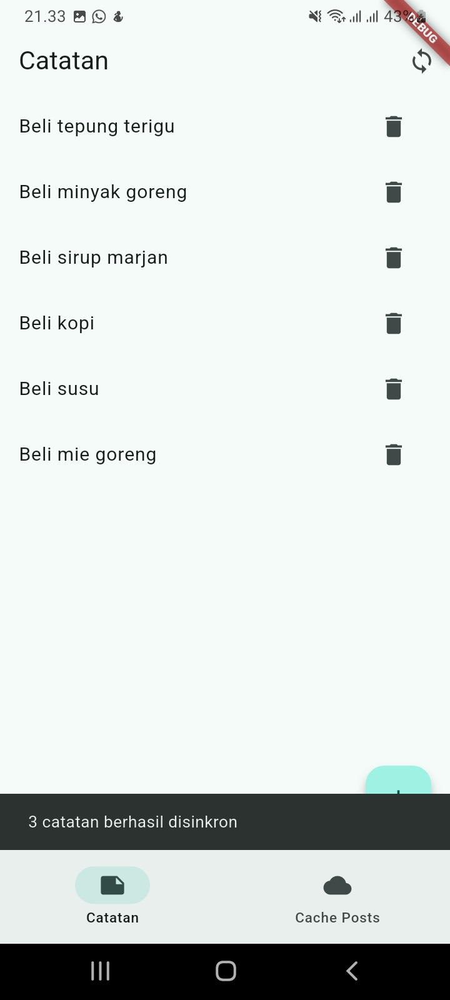 |

**4. `flutter analyze` tanpa issue dan semua test lulus.**<br>
 

**5. Hasil AI diverifikasi dan didokumentasikan pada folder `docs/`.**<br>
Hasil AI Prompt Challenge diverifikasi menggunakan AI Verification Checklist dan didokumentasikan lengkap pada [`docs/ai-verification.md`](docs/ai-verification.md).

---

### Mini Project: Aplikasi Offline Notes

Seluruh requirement mini project sudah terpenuhi:

1. **Preferensi tema + waktu terakhir dibuka via SharedPreferences:**<br>
Toggle mode gelap/terang diakses lewat halaman Pengaturan (`lib/pages/settings_page.dart`), disimpan lewat `PrefsRepository`.

| Mode Terang | Mode Gelap |
|---|---|
| 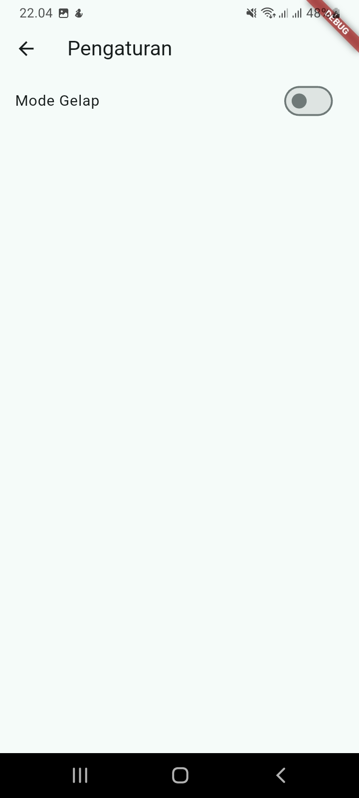 | 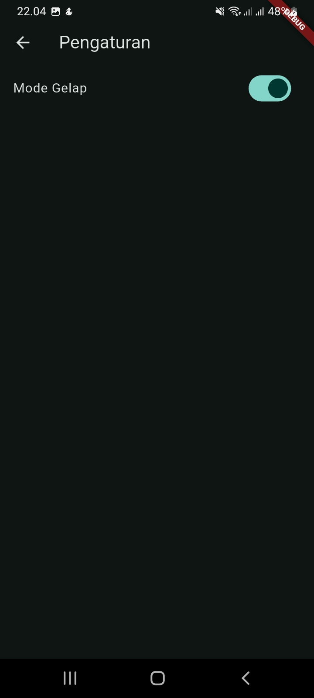 |

2. **CRUD catatan persisten via SQLite + repository + Riverpod, diurutkan `updated_at` terbaru:**<br>
Diimplementasikan pada `NoteRepository` dan `NotesNotifier`, ditampilkan di `NotesPage`.<br>

3. **Offline-first:**<br>
Cache-first read untuk data `GET /posts` (`PostsCachePage`), dirty flag + `syncNotes` untuk tulisan, dan aturan konflik *last-write-wins* berdasarkan `updated_at` (didokumentasikan, belum diuji dengan skenario konflik dua arah karena tidak ada backend tulis sungguhan).<br>

4. **Bukti mode pesawat:**<br>
Screenshot daftar catatan saat offline dan badge dirty sebelum/sesudah sync (dapat dilihat di bagian Checklist Verifikasi Mandiri poin 2 dan 3 di atas)<br>

5. **Minimal 2 test yang lulus:**<br>
Tiga unit test tersedia di `test/note_test.dart`: mapping model aman null dan persistensi flag `dirty` melalui serialisasi.<br> 
<br> 

6. **AI Challenge terdokumentasi:**<br>
Prompt, output awal AI (tabel perbandingan storage), hasil verifikasi (termasuk percobaan instalasi nyata Hive vs Drift), dan keputusan final didokumentasikan lengkap di [`docs/ai-verification.md`](docs/ai-verification.md).

7. **Struktur folder sesuai portofolio:**<br>
Project ditempatkan di `05-week-5-local-storage-offline-first/` dengan struktur `lib/`, `test/`, `docs/`, `screenshots/`, dan `README.md` ini.

#### Cara Menjalankan

```bash
cd 05-week-5-local-storage-offline-first
flutter pub get
flutter run
```

---

## Refleksi

1. **Mengapa daftar catatan tidak boleh disimpan di SharedPreferences? Apa yang rusak jika aturan ini dilanggar?**<br>
Jawaban:<br>
SharedPreferences dirancang untuk nilai primitif kecil (boolean, string, int tunggal), bukan untuk koleksi data yang tumbuh dan berubah. Jika daftar catatan disimpan sebagai satu string JSON di SharedPreferences, setiap kali ada satu perubahan kecil (tambah, hapus, atau edit satu catatan), seluruh string JSON harus dibaca, di-parse, diubah, lalu ditulis ulang secara utuh — tidak ada mekanisme update parsial seperti `UPDATE ... WHERE id = ?` pada SQL. Ini membuat operasi semakin lambat seiring bertambahnya jumlah catatan, rawan korup jika proses penulisan terganggu di tengah jalan (misalnya app force-close saat sedang menulis), dan tidak mendukung query seperti pengurutan berdasarkan `updated_at` atau filter berdasarkan `dirty` tanpa memuat seluruh data ke memori terlebih dahulu.

2. **Kapan cache-first cukup, dan kapan Anda membutuhkan strategi lain (misalnya network-first untuk data harga real-time)?**<br>
Jawaban:<br>
Cache-first cukup digunakan untuk data yang toleran terhadap keterlambatan sedikit basi (*stale*), seperti daftar post atau artikel yang tidak berubah setiap detik — pengguna lebih diuntungkan melihat sesuatu segera daripada menunggu jaringan, dan data akan diperbarui otomatis di background begitu tersedia. Namun untuk data yang nilainya berubah cepat dan salah jika ditampilkan basi, seperti harga saham, status ketersediaan kursi, atau saldo transaksi, strategi network-first lebih tepat: aplikasi harus menunggu response jaringan terbaru terlebih dahulu (dengan fallback ke cache hanya jika benar-benar offline), karena menampilkan data lama pada kasus ini bisa menyesatkan pengguna, bukan sekadar kurang nyaman.

3. **Bagaimana dirty flag berubah menjadi antrean sync tanpa memblokir UI? Kapan antrean terpisah (tabel outbox) menjadi perlu?**<br>
Jawaban:<br>
Pada implementasi ini, setiap perubahan lokal (tambah catatan) langsung ditandai `dirty = 1` di baris yang sama pada tabel `notes`, tanpa memblokir UI karena penandaan ini terjadi bersamaan dengan operasi insert/update yang sudah berjalan secara asinkron. Saat tombol sync ditekan, `syncNotes()` membaca seluruh baris `dirty = 1`, memprosesnya (disimulasikan dengan delay), lalu menandainya `dirty = 0` setelah "berhasil" — semua ini terjadi di `Future` terpisah sehingga UI tetap responsif dan hanya menampilkan badge jumlah dirty yang berubah reaktif lewat Riverpod. Namun, pendekatan menandai dirty langsung pada baris data ini cukup untuk kasus sederhana seperti catatan (hanya perlu tahu "sudah disinkron atau belum"). Tabel outbox terpisah menjadi perlu ketika operasi yang harus disinkronkan lebih kompleks dari sekadar "kirim state terbaru" — misalnya perlu mencatat *urutan* operasi (tambah, lalu edit, lalu hapus) secara terpisah agar bisa di-replay persis ke server sesuai urutan aslinya, atau ketika satu perubahan lokal bisa menghasilkan lebih dari satu request ke server.

4. **Bagian mana dari rekomendasi AI yang Anda tolak, dan mengapa?**<br>
Jawaban:<br>
Rekomendasi final AI (SharedPreferences untuk preferensi, sqflite untuk catatan) tidak ditolak, melainkan diterima setelah diverifikasi lewat percobaan instalasi nyata. Namun, dua detail teknis di luar tabel perbandingan AI ditemukan sendiri saat verifikasi: pertama, versi `sqlite3_flutter_libs` yang terinstal otomatis (`^0.6.0+eol`) ternyata ditandai *end-of-life* oleh maintainer-nya — informasi yang tidak disebutkan AI saat merekomendasikan Drift sebagai alternatif. Kedua, flag `--delete-conflicting-outputs` yang umum digunakan pada perintah `build_runner` ternyata sudah *deprecated* pada versi `build_runner` yang terinstal di proyek ini. Kedua temuan ini menunjukkan bahwa perbandingan konsep dari AI, meski akurat secara logika, tetap perlu diuji terhadap kondisi package dan versi yang sebenarnya terinstal, karena AI tidak selalu mengetahui status maintenance atau perubahan API terbaru dari suatu package.

---
