# LAPORAN PRAKTIKUM - WEEK 6 PEMROGRAMAN MOBILE

## Identitas Mahasiswa

| Keterangan | Detail |
|---|---|
| Nama | Mufliha Hafsyah Shahieza |
| NIM | 244107020147 |
| Kelas | TI-3G |

---

## JOBSHEET WEEK 6 Authentication, Security & FCM

---
### Praktikum 1: Login, Secure Storage, dan Token Refresh

#### Hasil Implementasi

| Halaman Login | Login Gagal (validasi) | Halaman Home | 
|---|---|---|
| 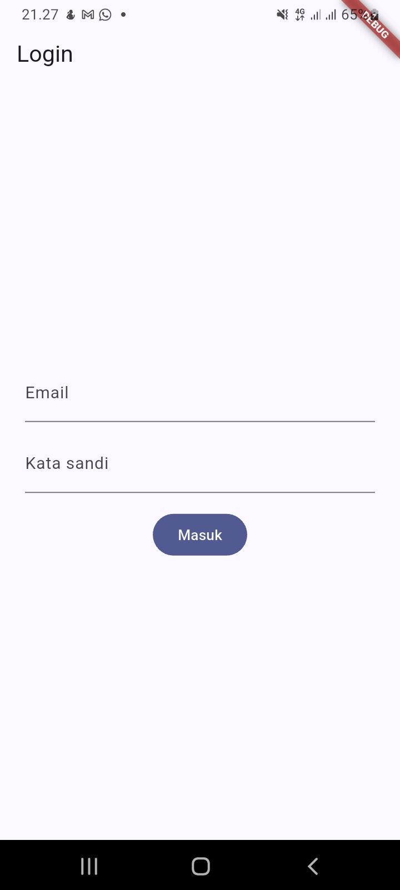 | 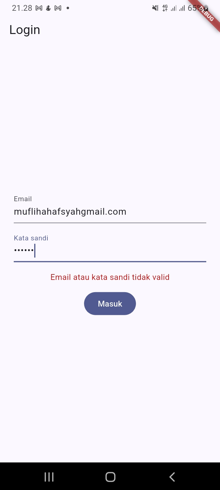 | 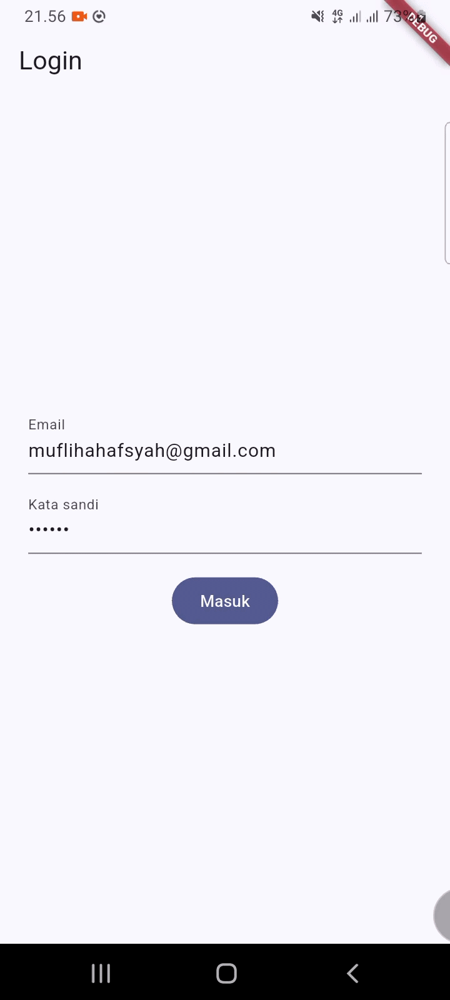 |

**Uji persistensi token:**

| Uji | Langkah | Hasil yang Diharapkan | Hasil |
|---|---|---|---|
| Token bertahan | Login berhasil, tutup aplikasi total dari recent apps, buka lagi | Langsung masuk Home tanpa login ulang  | 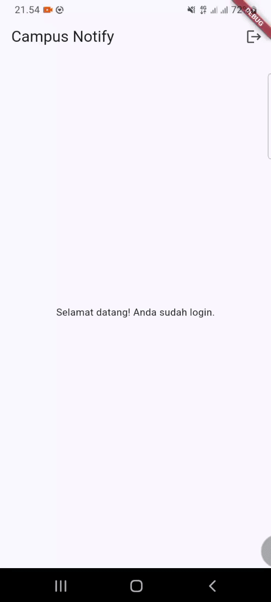 |
| Logout menghapus token | Tekan logout, tutup aplikasi total, buka lagi | Tetap di halaman Login | 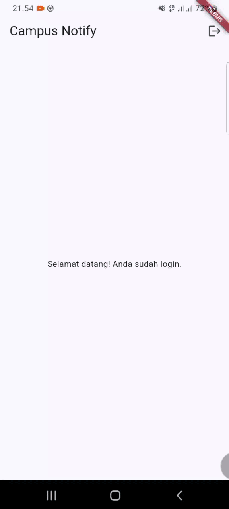 |

#### Analisis

- Uji tutup-buka aplikasi membuktikan bahwa `flutter_secure_storage` menyimpan token secara persisten melewati siklus hidup aplikasi, bukan hanya di memori. 
- `AuthNotifier.build()` yang membaca `readAccess()` setiap aplikasi mulai memastikan status login dipulihkan otomatis dari token yang tersimpan, tanpa perlu flag tambahan di tempat lain. 
- Uji logout membuktikan `store.clear()` benar-benar menghapus seluruh token, sehingga `build()` berikutnya membaca `null` dan guard route mengarahkan kembali ke `/login`.

---
### Praktikum 2: FCM, Permission, dan Token Lifecycle

#### Hasil Implementasi

| Token FCM (Terpotong) di Halaman Debug | Notifikasi Masuk dari Firebase Console |
|---|---|
| 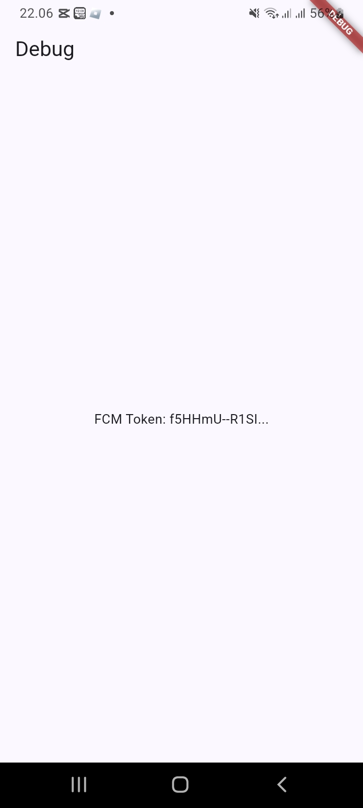 | 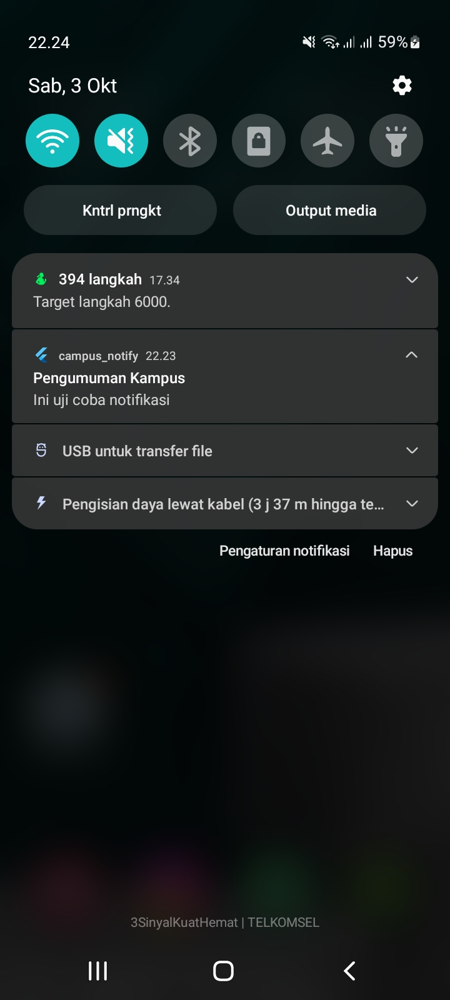 |

#### Analisis

Notifikasi yang berhasil masuk ke panel sistem Android saat aplikasi berjalan di background membuktikan bahwa pendaftaran token dan topik ke FCM sudah berfungsi dengan benar, serta mengonfirmasi bahwa project Firebase (package name, `google-services.json`, dan konfigurasi Gradle) sudah terpasang secara tepat.

#### Uji Reinstall/Clear Data membuktikan Token Berubah

| Token Sebelum Clear Data | Token Setelah Clear Data |
|---|---|
| 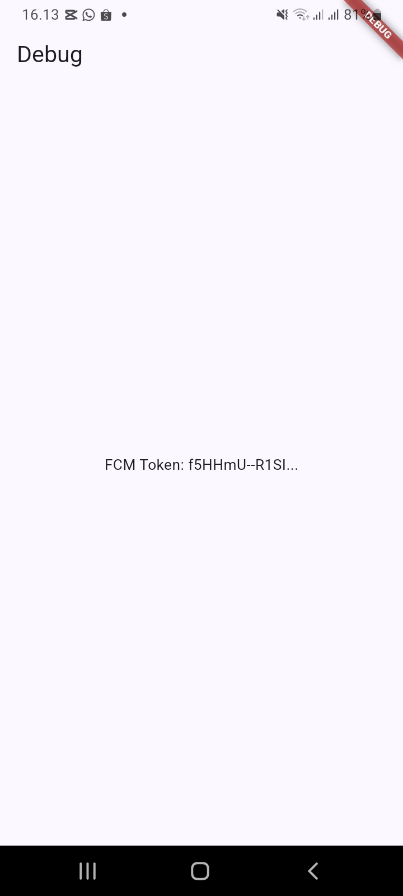 |  |

Data aplikasi dihapus lewat Settings > Apps > Campus Notify > Clear Data untuk mensimulasikan reinstall. Setelah aplikasi dibuka kembali dan login ulang, token FCM yang tampil di halaman Debug terbukti berbeda dari token sebelumnya, membuktikan `getToken()` berhasil mengambil registration token baru yang digenerate sistem setelah data lama dihapus.

---
### Praktikum 3: Payload, Tiga App State, Klik dan Topik

#### Matriks Pengujian

| State | Yang diharapkan | Cara uji | Hasil |
|---|---|---|---|
| Foreground | Banner lokal muncul, klik masuk ke `/pengumuman/3` | Aplikasi terbuka, kirim dari Firebase Console | 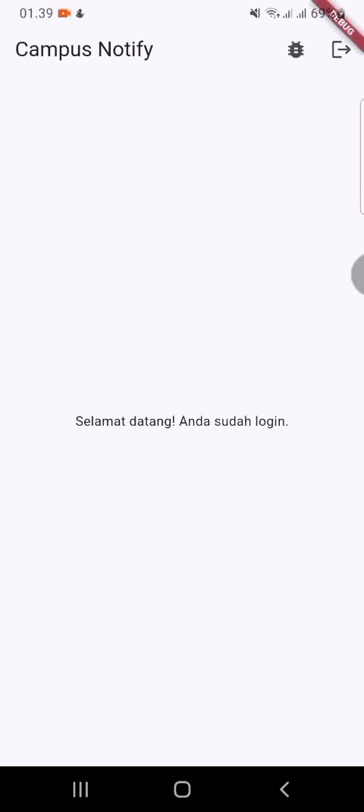 |
| Background | Banner sistem muncul, klik masuk ke rute yang benar | Tekan Home, kirim, klik notifikasi |  |
| Terminated | Aplikasi terbuka ke rute yang benar via `getInitialMessage` | Swipe-close aplikasi, kirim, klik notifikasi | 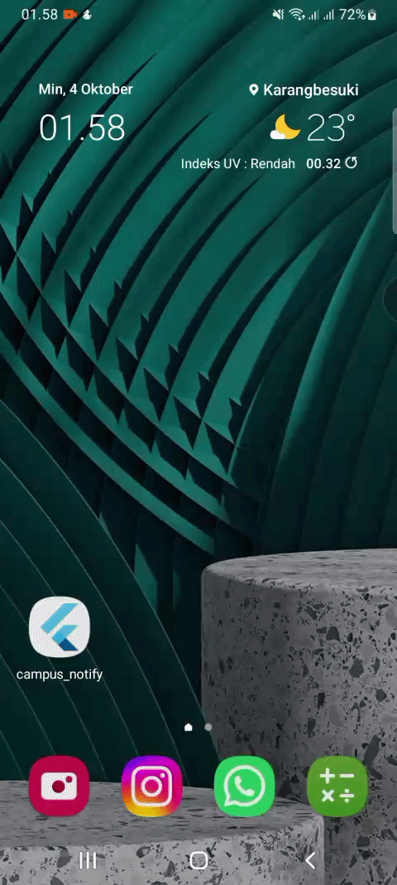 |

#### Topic Messaging

| Target: Topic di Firebase Console | Notifikasi Diterima |
|---|---|
| 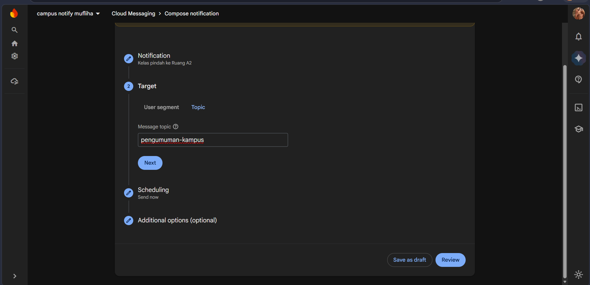 | 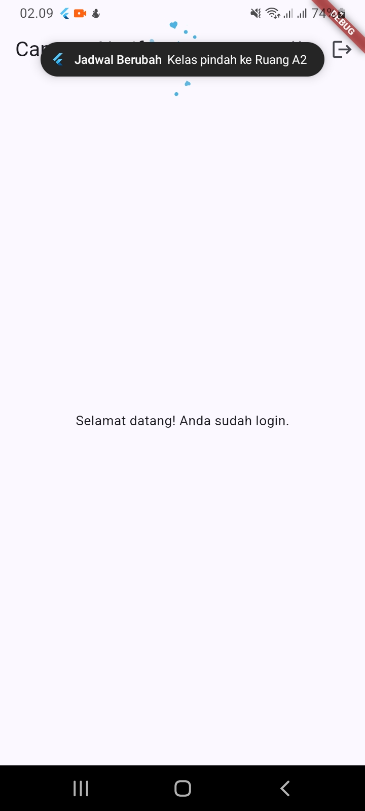 |

Subscribe ke topik `pengumuman-kampus` dilakukan otomatis saat `initFcmToken()` dipanggil (Praktikum 2). Pengujian ini membuktikan notifikasi tetap sampai ke device meski dikirim lewat topic, bukan langsung ke token aplikasi, cocok dipakai untuk pesan broadcast seperti pengumuman seluruh mahasiswa.

#### Analisis

Ketiga app state berhasil diuji dengan payload gabungan `notification + data`, membuktikan bahwa `data.route` konsisten tersedia dan dapat diproses baik oleh handler foreground (`onMessage`), klik dari background (`onMessageOpenedApp`), maupun saat aplikasi dibuka dari kondisi mati total (`getInitialMessage`). Bug `pendingDeepLink` yang ditemukan pada percobaan pertama Uji Foreground menunjukkan pentingnya menguji klik notifikasi pada kondisi nyata, bukan hanya memastikan notifikasi tampil di layar, modul secara eksplisit menyebut hal ini sebagai salah satu bug FCM paling mahal yang tidak terlihat hanya dari membaca kode.

---
### AI Prompt Challenge

Dokumentasi lengkap (prompt, output awal AI, audit checklist, dan perbandingan dengan implementasi manual) ada di:

[docs/ai-verification.md](docs/ai-verification.md)

---
### Refactoring Challenge

Tiga penyesuaian dilakukan untuk merapikan struktur kode:<br>
1. **Konstanta rute** (`lib/routes.dart`): seluruh string path (`/login`, `/`, `/debug`, `/pengumuman/:id`) yang sebelumnya tersebar sebagai literal string di `main.dart` dipusatkan dalam kelas `Routes`, termasuk helper `Routes.announcement(id)` untuk membentuk path deep link secara konsisten.
2. **`routeFromMessage()` sebagai fungsi murni** (`lib/messaging/push_service.dart`): dipisah sejak Praktikum 3 agar dapat diuji tanpa bergantung pada Firebase sungguhan.
3. **Mapping error Dio** (`lib/data/api_errors.dart`): fungsi `friendlyAuthError()` menggantikan penanganan error yang sebelumnya ditulis langsung di `LoginPage`, sehingga dapat dipakai ulang di bagian lain yang memanggil `AuthRepository` atau `apiClientProvider`.

#### Hasil Implementasi

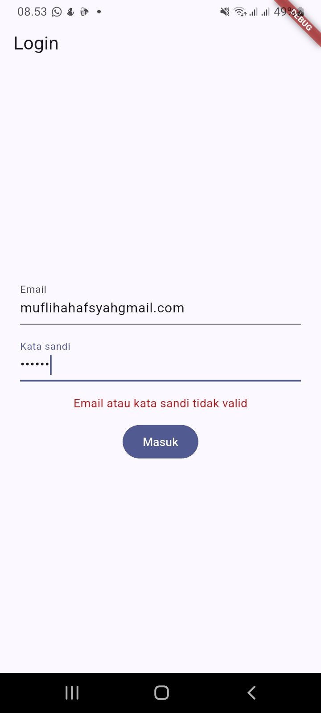

#### Analisis

Rute yang dipusatkan ke kelas `Routes` mengurangi risiko salah ketik path dan mempermudah perubahan struktur URL di masa depan. Mapping error Dio yang dipindah ke `api_errors.dart` membuat pesan error bisa dipakai ulang tanpa duplikasi logic di halaman lain.

---
### Testing

**Test mengikuti pola modul (`test/auth_push_test.dart`):**<br>
1. `routeFromMessage` bisa menangani route kosong dan route yang tidak diawali garis miring.
2. Data payload membawa `id` pengumuman bersamaan dengan `route`.
3. Provider auth membaca status login dari ada tidaknya access token.
4. Sesi dibersihkan saat refresh token kosong, sehingga memaksa login ulang.
<br>

**Test tambahan yang lebih menyeluruh:**<br>
- `test/push_service_test.dart` menguji `routeFromMessage()` versi asli di `push_service.dart`, mencakup tiga kondisi: route langsung dari `data['route']`, route yang dinormalisasi karena tidak diawali `/`, dan default ke `/` saat data kosong.
- `test/token_store_test.dart` menguji `TokenStore` memakai `FakeSecureStorage`, yaitu implementasi tiruan dari `FlutterSecureStoragePlatform`. Berbeda dari `FakeTokenStore` sederhana pada modul, pendekatan ini menguji langsung kelas `TokenStore` yang dipakai aplikasi, bukan hanya meniru ulang logicnya. Dua hal yang diuji: token access dan refresh tersimpan serta dapat dibaca kembali setelah `save()`, dan `clear()` benar-benar menghapus seluruh token yang tersimpan.
- `test/widget_test.dart` bawaan `flutter create` dikosongkan karena masih berisi pengujian counter default yang sudah tidak relevan, dan akan gagal karena `MyApp` sekarang membutuhkan `ProviderScope`.
<br>

**Hasil:**<br>
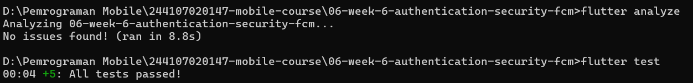

---
### Checklist Verifikasi Mandiri

**1. Token hanya di `flutter_secure_storage`, tidak di SharedPreferences/log/screenshot penuh.**<br>

`TokenStore` (`lib/data/token_store.dart`) menggunakan `flutter_secure_storage`, dibuktikan unit test `token_store_test.dart`. Token FCM juga dipotong menjadi 12 karakter **sebelum** disimpan ke state, sehingga tidak pernah ada token penuh di memori aplikasi maupun layar. Uji clear data/reinstall pada Praktikum 2 turut membuktikan token berganti secara aman setiap kali perangkat kehilangan data lama.<br>

<br><br>

**2. 401 memicu refresh sekali lalu retry; refresh mati memaksa login ulang.**<br>

Diimplementasikan pada interceptor `onError` di `buildApiClient()` (`lib/data/api_client.dart`): saat menerima 401, refresh token ditukar dan request diulang satu kali. Bila refresh ikut gagal, `store.clear()` dipanggil sehingga guard route memaksa pengguna login ulang.
<br>

**3. Ketiga app state teruji dengan tabel bukti; klik masuk ke rute yang benar.**<br>

| State | Diharapkan | Cara Uji | Hasil |
|---|---|---|---|
| Foreground | Banner lokal muncul, klik masuk ke `/pengumuman/3` | Aplikasi terbuka, kirim dari Firebase Console | Berhasil |
| Background | Banner sistem muncul, klik masuk ke rute yang benar | Tekan Home, kirim, klik notifikasi | Berhasil |
| Terminated | Aplikasi terbuka ke rute yang benar via `getInitialMessage` | Swipe-close aplikasi, kirim, klik notifikasi | Berhasil |

<br>

| Foreground | Background | Terminated |
|---|---|---|
|  |  |  |
<br><br>

**4. Topik untuk broadcast, token untuk pesan personal.**<br>

Subscribe ke topic `pengumuman-kampus` dilakukan otomatis pada `initFcmToken()`, dibuktikan notifikasi tetap sampai meski dikirim lewat Target: Topic di Firebase Console (bukan langsung ke device), lihat Praktikum 3.<br>

| Target: Topic | Notifikasi Diterima |
|---|---|
|  |  |
<br><br>

**5. `flutter analyze` bersih dan semua test lulus.**<br>


---
### Mini Project: Campus Notification App

Seluruh requirement mini project sudah terpenuhi melalui pengerjaan praktikum dan tantangan di atas:<br>

**1. Login (mock/Firebase Auth) dengan guard route: belum login selalu diarahkan ke /login.**<br>

Diimplementasikan pada `AuthRepository` dan `GoRouter.redirect`, dibuktikan lewat uji tutup-buka aplikasi pada Praktikum 1 (lihat Checklist poin 1 dan 3).<br><br>

**2. Token disimpan di secure storage; Dio otomatis refresh sekali saat 401 dan logout bila refresh mati.**<br>

`TokenStore` menggunakan `flutter_secure_storage`. Interceptor pada `buildApiClient()` menukar refresh token saat 401 dan mengulang request satu kali. Bila refresh ikut gagal, seluruh token dihapus lewat `store.clear()`. Perilaku ini belum diuji lewat unit test karena membutuhkan mock HTTP response 401, dan diverifikasi secara manual lewat pembacaan kode serta alur login/logout pada Praktikum 1.<br><br>

**3. FCM terintegrasi: permission, getToken + onTokenRefresh terkirim ke backend (atau didokumentasikan endpoint POST /devices), dan subscribe topik pengumuman-kampus.**<br>

`initFcmToken()` (`lib/messaging/push_service.dart`) meminta izin notifikasi, mengambil token awal, mendaftarkan listener `onTokenRefresh`, dan subscribe topic. Endpoint backend sungguhan belum tersedia (mock project), sehingga pengiriman token ditandai sebagai `TODO: kirim token ke backend sungguhan` dengan endpoint yang didokumentasikan sebagai `POST /devices` pada `main.dart`.
<br><br>

**4. Notifikasi gabungan notification + data; klik membuka /pengumuman/:id pada ketiga app state. Isi tabel pengujian foreground/background/terminated di README.**<br>
| State | Diharapkan | Cara Uji | Hasil |
|---|---|---|---|
| Foreground | Banner lokal muncul, klik masuk ke `/pengumuman/3` | Aplikasi terbuka, kirim dari Firebase Console | Berhasil |
| Background | Banner sistem muncul, klik masuk ke rute yang benar | Tekan Home, kirim, klik notifikasi | Berhasil |
| Terminated | Aplikasi terbuka ke rute yang benar via `getInitialMessage` | Swipe-close aplikasi, kirim, klik notifikasi | Berhasil |

<br>

| Foreground | Background | Terminated |
|---|---|---|
|  |  |  |

**5. Screenshot bukti (token terpotong, banner tiap state, halaman tujuan deep link) di folder screenshots/.**<br>

| Token Terpotong | Notifikasi Masuk | Halaman Tujuan Deep Link |
|---|---|---|
|  |  |  |

Bukti lengkap untuk tiap app state (foreground, background, terminated) berupa rekaman, dapat dilihat pada Praktikum 3.<br><br>

**6. Sertakan minimal 2 test yang lulus (parsing route + logika sesi/refresh).**<br>

9 unit test tersebar di tiga file: `test/auth_push_test.dart` (mengikuti pola modul: parsing route dan logika sesi/refresh), `test/push_service_test.dart` (parsing `routeFromMessage` versi asli), dan `test/token_store_test.dart` (penyimpanan dan penghapusan token lewat `TokenStore` sungguhan). Detail lengkap ada di bagian Testing.<br><br>

**7. Hasil AI Prompt Challenge terdokumentasi.**<br>

Lihat [`docs/ai-verification.md`](docs/ai-verification.md).<br><br>

**8. Push ke repository portfolio pada folder 06-week-6-authentication-security-fcm/ dengan struktur lib/, test/, docs/, README.md, dan screenshots/. README menjelaskan tujuan, fitur utama, stack teknologi, cara menjalankan, dan hasil yang dicapai.**<br>

Project ditempatkan di `06-week-6-authentication-security-fcm/` dengan struktur `lib/`, `test/`, `docs/`, `screenshots/`, dan `README.md` ini.

#### Cara Menjalankan

```bash
cd 06-week-6-authentication-security-fcm
flutter pub get
flutter run
```
<br>
Catatan: project ini membutuhkan file `android/app/google-services.json` dari project Firebase masing-masing untuk fitur FCM berfungsi. File ini sengaja tidak disertakan di repository karena bersifat sensitif.

---
## Refleksi

**1. Mengapa refresh token tidak boleh disimpan di SharedPreferences? Apa risikonya bila bocor?**<br>

Jawaban:<br>
SharedPreferences menyimpan data dalam file XML biasa yang tidak terenkripsi, jadi kalau perangkat di-root atau diakses orang lain, isinya bisa langsung dibaca. Refresh token itu kredensial yang umurnya panjang dan bisa dipakai berkali-kali untuk minta access token baru, jadi kalau bocor, penyerang bisa terus menyamar jadi pengguna dalam waktu lama tanpa perlu login ulang atau tahu password, bahkan setelah access token lamanya kedaluwarsa. `flutter_secure_storage` menyimpan data terenkripsi lewat Keystore Android, sehingga jauh lebih sulit diambil.<br><br>

**2. Apa yang rusak bila `onTokenRefresh` diabaikan selama satu semester perkuliahan?**<br>

Jawaban:<br>
Token FCM bisa berubah kapan saja, misalnya saat aplikasi di-reinstall, data aplikasi dihapus, atau ada rotasi token oleh sistem. Kalau listener `onTokenRefresh` tidak ada, backend kampus tetap menyimpan token lama yang sudah tidak valid, sehingga notifikasi pengumuman yang dikirim ke mahasiswa tersebut tidak akan pernah sampai lagi, padahal dari sisi aplikasi sepertinya semua baik-baik saja karena tidak ada error yang muncul. Selama satu semester, ini bisa berarti banyak mahasiswa diam-diam berhenti menerima notifikasi tanpa ada yang menyadarinya sampai ada yang komplain ketinggalan pengumuman penting.<br><br>

**3. Kapan memakai topik dan kapan memakai token perangkat? Beri contoh pesan kampus untuk masing-masing.**<br>

Jawaban:<br>
Topic cocok dipakai untuk pesan broadcast yang ditujukan ke banyak orang sekaligus tanpa perlu tahu device masing-masing, misalnya pengumuman libur kampus atau perubahan jadwal UTS yang berlaku untuk semua mahasiswa yang subscribe topic `pengumuman-kampus`. Token perangkat dipakai untuk pesan personal yang hanya relevan untuk satu pengguna tertentu, misalnya notifikasi "Nilai UAS Pemrograman Mobile Anda sudah keluar" atau "Tagihan UKT Anda belum dibayar", yang jelas tidak boleh dikirim ke semua orang lewat topic.<br><br>

**4. Bagian mana dari draf AI yang Anda tolak atau perbaiki, dan mengapa?**<br>

Jawaban:<br>
Draf `PushService` dari AI diverifikasi pakai AI Verification Checklist dan gagal di 5 dari 6 poin, sehingga ditolak seluruhnya dan tidak dipakai di project. Masalah utamanya: background handler ditulis sebagai method kelas tanpa `@pragma('vm:entry-point')`, `onTokenRefresh` cuma `print()` tanpa kirim ke backend, tidak ada listener `onMessage` sama sekali sehingga notifikasi tidak tampil saat foreground, fungsi navigasi kosong, dan token lengkap dicetak ke log. Karena tingkat kegagalannya tinggi, bukan draf ini yang diperbaiki, melainkan didokumentasikan sebagai perbandingan terhadap implementasi manual pada Praktikum 1–3 yang sejak awal sudah menghindari seluruh masalah tersebut.

---